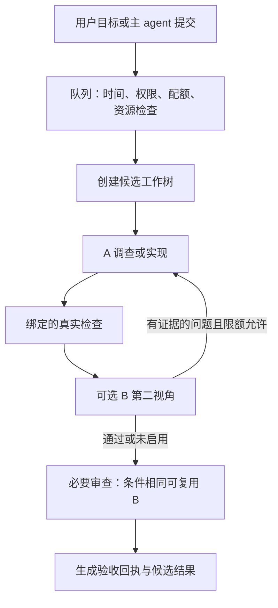

# 工作原理

[文档首页](../README.md) · [使用手册](usage.md) · [配置参考](configuration.md)

## 两种执行路径

| 普通 Pi 会话 | 受管 inspect / fix |
|---|---|
| 当前 agent 使用当前模型、工具和工作目录 | 主 Pi agent 提交固定模板任务，由子 agent 执行 |
| begin 只建立统计边界，不发送模型请求 | 提交时自动建立任务及统计关联 |
| 测试和结果检查由普通 agent/用户决定 | 根任务规定真实检查与必要审查 |
| accept 表示用户认可 | COMPLETED 必须来自当前有效验收回执 |

普通会话不因为 begin 而获得隔离工作树或多模型编排。未 begin 的会话也可记录临时分组，但缺少可靠任务边界的数据不作为自动历史排名的成功样本。

## 受管流程

fix 创建工作树后先运行基线构建，再进入实现；构建/测试失败只有被可信解析器明确归类为实现错误时才允许有限自动修复。inspect 保持只读。测试退出码0但零测试、全部跳过或缺失计数不能证明通过。

A 是唯一写入者，B 使用独立只读上下文。B 默认最多两次回应/复核交换；配置上限、原修复次数、派发步数、请求预算、profile时限和任务deadline共同约束，先到的上限生效。同模型的两个上下文仍会如实显示同模型，不声称独立权重。

必要审查读取当前候选、检查和失败工件。只有快照、根要求版本、模型/profile、证据、运行身份和独立性等条件相同，B的完整审查才可复用。双方同意不能覆盖真实检查失败。

## 三种身份

- `taskId`：统计任务，跨多轮、换模和辅助调用归集投入。
- `jobId`：受管执行任务，关联候选目录、步骤和验收回执。直接提交时通常与统计ID相同；主 agent 派生的job可归入父统计任务。
- `workScope`：执行责任和预算范围。新建统计分组、重试、fork或再建job不自动清空原范围的预算。

状态保存在本机私有SQLite目录。事实包括派发意图、实际请求、owner/epoch、资源占用、原始错误及独立工件。相同状态根才能共同协调；不同状态根不共享全机硬上限。

## 恢复不是重新做一遍

全局→供应商→模型解析退避策略。每个任务的本地退避和同配额/网络域的服务器最早重试时间分别保存，实际恢复取较晚者：本地上限1h不能截短服务器要求的2h。

等待结束后仍须重新检查授权、会话/模型、期限、资源和已发请求是否结束。原生 continuation 保留当前上下文和已完成工具效果，不为了重试而重放已确认的写入。永久错误、未知重置策略和无法证明终止的执行会阻塞或暂停。

暂停撤销后续自动派发；停止另外请求终止。停止请求、PID退出与整个工具工作结束不是同一事实。未知writer继续占用资源，不能因为超时或重启就放行另一个冲突writer。详见[请求准入](request-admission.md)。

## 统计与价格

一次模型生成有稳定generation ID，内部HTTP重试有各自attempt ID，工具调用和A/B交换另计。子端转发或重复导入同一用量不重复收费；合法修订保留原始记录，冲突会标记待核对。

费用区分实际、SDK/价目估算和未知，币种分列。缺失usage不补0，最终响应只覆盖部分重试时明确标记。价目表与套餐引用在生成开始时固定；历史重估另列，不改原账。

历史比较累计整个任务及失败/取消投入，按用户组、工作合同、输入规模和模型版本区分。自动选择默认关闭；开启后先做能力/权限过滤，再按配置顺序、时段或合格历史数据选择。目录和选择开关不应使相同工作的旧样本失配；实际工具/检查、预算或B合同变化仍保守分组。

## 时间与范围

定时只决定任务何时开始，不是逐请求避峰。启动前不占活动槽位；任务跨出窗口后继续，但单次HTTP请求、child总时限和任务deadline仍各自有效。Pi退出后不执行；重开后未来任务排队，错过的未启动任务暂停。

本版提供固定模板、可选诊断重规划和有界第二视角，不提供任意多模型执行图、质量失败自动升级模型、后台守护进程、周期任务或付费探索。更详细的范围见[发布说明](release-notes.md)。
