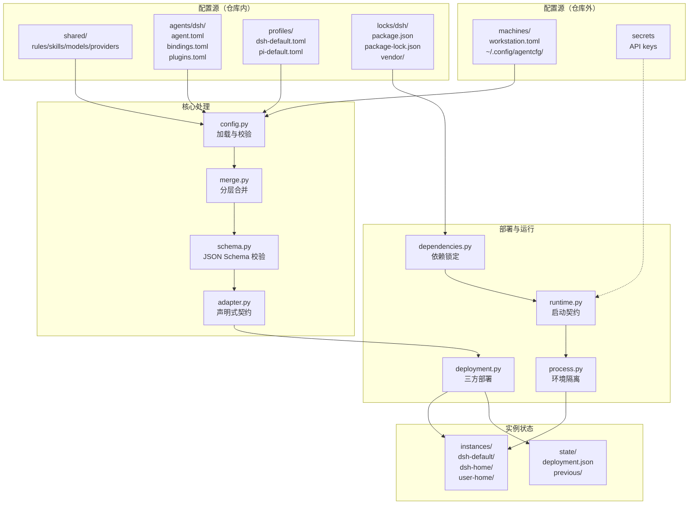

# agentcfg 架构与设计原理（临时笔记）

> 本文档为架构分析临时记录，供学习参考。

## 整体架构



## 配置层次与合并顺序

```text
┌─────────────────────────────────────────────────────────────┐
│  Layer 5: Request Parameters                                │
│  (--profile, --cwd, --machine)                              │
├─────────────────────────────────────────────────────────────┤
│  Layer 4: Local Machine Overrides                           │
│  (~/.config/agentcfg/machines/workstation.toml)             │
│  - secrets, environment.inherit, paths, overrides           │
├─────────────────────────────────────────────────────────────┤
│  Layer 3: Profile Selection                                 │
│  (profiles/dsh-default.toml)                                │
│  - providers, models, rules, skills, plugins                │
├─────────────────────────────────────────────────────────────┤
│  Layer 2: Adapter Defaults                                  │
│  (agents/dsh/agent.toml)                                    │
│  - defaults.providers, defaults.skills                      │
├─────────────────────────────────────────────────────────────┤
│  Layer 1: Shared Registry                                   │
│  (shared/content.toml, shared/models.toml)                  │
│  - 所有可用的 rules/skills/models/providers 定义            │
└─────────────────────────────────────────────────────────────┘
                    ↓
              合并规则：
              - 对象：递归合并
              - 数组：整体替换
              - 标量：后者覆盖前者
              - 秘密：分离存储，不进快照
```

## 核心设计原则

### 1. 隔离优先

```text
┌──────────────────────────────────────────────────────────────┐
│  父进程（你的 shell）                                         │
│  - http_proxy=http://127.0.0.1:10808                        │
│  - AWS_ACCESS_KEY_ID=...                                    │
│  - GITHUB_TOKEN=...                                         │
└──────────────────┬───────────────────────────────────────────┘
                   │ subprocess.run(env=...)
                   ↓
┌──────────────────────────────────────────────────────────────┐
│  agentcfg 子进程（白名单过滤）                                │
│  - PATH, HOME, USER, SHELL, TERM, LANG                      │
│  - LC_* 开头的环境变量                                       │
│  - machine.environment.inherit 显式声明的变量                │
│  - 密钥通过 SecretRef 延迟解析                               │
└──────────────────┬───────────────────────────────────────────┘
                   │
                   ↓
┌──────────────────────────────────────────────────────────────┐
│  DSH 实例（隔离 HOME）                                        │
│  - HOME = instances/dsh-default/user-home                   │
│  - DSH_HOME = instances/dsh-default/dsh-home                │
│  - XDG_* 重写到实例内                                        │
│  - 不继承父进程的凭据                                          │
└──────────────────────────────────────────────────────────────┘
```

**代码证据**（`process.py`）：
```python
BASE_ENV = frozenset({
  "PATH", "HOME", "USER", "LOGNAME", "SHELL", "TERM", "COLORTERM", "LANG",
  "TZ", "TMPDIR", "TMP", "TEMP", "EDITOR", "VISUAL", "SSH_TTY", "SSH_AUTH_SOCK",
  "TMUX", "TMUX_PANE", "XDG_CONFIG_HOME", "XDG_DATA_HOME", "XDG_STATE_HOME",
  "XDG_CACHE_HOME", "XDG_RUNTIME_DIR"
})
```

### 2. 确定性锁定

```text
┌─────────────────────────────────────────────────────────────┐
│  locks/dsh/                                                  │
├─────────────────────────────────────────────────────────────┤
│  manifest.json                                               │
│  - identity: SHA256(package.json + package-lock.json)       │
│  - recipe: SHA256(agent.toml + plugins.toml + vendor/*)     │
│  - node: v24.14.0 (精确版本)                                │
│  - npm: 11.19.1 (精确版本)                                  │
│  - upstream: host/tui/cursor/openspec 的 commit SHA         │
├─────────────────────────────────────────────────────────────┤
│  vendor/                                                     │
│  - dsh-tui-0.10.1-agentcfg.1.tgz (固定归档)                 │
│  - oauth-subs-0.0.88-agentcfg.1.tgz (固定归档)              │
│  - cursor-managed.patch (可审查补丁)                        │
│  - cursor-provenance.json (补丁前后哈希)                     │
├─────────────────────────────────────────────────────────────┤
│  package-lock.json                                           │
│  - 完整依赖树，每个包的 integrity 哈希                       │
│  - npm ci --ignore-scripts 安装                             │
└─────────────────────────────────────────────────────────────┘
```

### 3. 三方部署

```text
┌─────────────────────────────────────────────────────────────┐
│  B (Baseline)                                                │
│  首次部署时的空状态或原生默认值                              │
└─────────────────────────────────────────────────────────────┘
                    ↓
┌─────────────────────────────────────────────────────────────┐
│  C (Current)                                                 │
│  当前实例中的实际状态                                          │
│  - 用户手动修改的字段保留                                    │
│  - 漂移 ≠ 接受新基线                                         │
└─────────────────────────────────────────────────────────────┘
                    ↓
┌─────────────────────────────────────────────────────────────┐
│  D (Desired)                                                 │
│  期望状态（从配置渲染）                                        │
│  - 确定性产物（bytes 或字段期望）                            │
│  - 秘密引用只存环境变量名                                    │
└─────────────────────────────────────────────────────────────┘
                    ↓
         合并策略：
         - B → C：保留用户修改
         - C → D：应用期望变更
         - 冲突：明确失败，不静默覆盖
```

### 4. Adapter 契约

```text
┌─────────────────────────────────────────────────────────────┐
│  Adapter 接口（adapter.py）                                  │
├─────────────────────────────────────────────────────────────┤
│  declaration                                                 │
│  - adapter_id: "dsh" | "pi"                                 │
│  - schema_version: 数据 schema 版本                          │
│  - adapter_version: "dsh-1" | "pi-1"                        │
├─────────────────────────────────────────────────────────────┤
│  validate(data)                                              │
│  - 校验配置的能力、引用、原生映射                            │
│  - 不执行 IO、不解析秘密                                     │
├─────────────────────────────────────────────────────────────┤
│  managed_targets(data)                                       │
│  - FILE: 整文件所有权                                        │
│  - FIELDS: 字段级所有权（JSON Pointer）                      │
│  - INITIALIZE: 首次创建                                      │
│  - RUNTIME: 运行时拥有                                       │
│  - PACKAGE: 包管理器拥有                                     │
├─────────────────────────────────────────────────────────────┤
│  render(data) → Artifact[]                                   │
│  - 非秘密确定性字节                                          │
│  - 字段 Artifact 只编码期望值                                │
├─────────────────────────────────────────────────────────────┤
│  launch_spec(data)                                           │
│  - argv: 启动命令                                            │
│  - cwd: 工作目录                                             │
│  - environment: 字面值 + SecretRef                           │
│  - lock_identity: 运行包身份                                 │
└─────────────────────────────────────────────────────────────┘
```

## 数据流与命令映射

```text
┌─────────────────────────────────────────────────────────────┐
│  ./agentcfg validate                                         │
│  - 加载配置源                                                │
│  - 分层合并                                                  │
│  - JSON Schema 校验                                          │
│  - 输出：valid/invalid                                       │
└─────────────────────────────────────────────────────────────┘
                    ↓
┌─────────────────────────────────────────────────────────────┐
│  ./agentcfg render                                           │
│  - adapter.render(data) → Artifact[]                        │
│  - 写入 cache/rendered/<generation>/                        │
│  - 不修改实例                                                │
└─────────────────────────────────────────────────────────────┘
                    ↓
┌─────────────────────────────────────────────────────────────┐
│  ./agentcfg plan                                             │
│  - 比较 Current vs Desired                                   │
│  - 输出变更列表（create/update/delete）                      │
│  - 检测冲突（所有权重叠、漂移）                              │
└─────────────────────────────────────────────────────────────┘
                    ↓
┌─────────────────────────────────────────────────────────────┐
│  ./agentcfg sync                                             │
│  - 解析 lock                                                 │
│  - npm ci --ignore-scripts                                  │
│  - 校验 helper 权限                                          │
│  - 安装到 instances/<profile>/runtimes/<identity>/          │
└─────────────────────────────────────────────────────────────┘
                    ↓
┌─────────────────────────────────────────────────────────────┐
│  ./agentcfg apply                                            │
│  - 原子单文件写                                              │
│  - 维护 previous 备份                                        │
│  - 更新 deployment.json                                      │
│  - 失败时 pending 恢复                                       │
└─────────────────────────────────────────────────────────────┘
                    ↓
┌─────────────────────────────────────────────────────────────┐
│  ./agentcfg run dsh --cwd /path                              │
│  - 读取已部署启动契约                                        │
│  - 解析 SecretRef（实时）                                    │
│  - 构造白名单环境                                            │
│  - subprocess.run(argv, env=...)                            │
└─────────────────────────────────────────────────────────────┘
                    ↓
┌─────────────────────────────────────────────────────────────┐
│  ./agentcfg doctor                                           │
│  - 检查部署状态                                              │
│  - 检查依赖安装                                              │
│  - 检测漂移                                                  │
│  - 可选 --live 检查服务可达性                                │
└─────────────────────────────────────────────────────────────┘
```

## 安全边界

```text
┌─────────────────────────────────────────────────────────────┐
│  路径安全                                                    │
├─────────────────────────────────────────────────────────────┤
│  - 逐段 no-follow 打开目录                                   │
│  - 检查属主（当前用户）和权限（0700/0600）                   │
│  - 拒绝符号链接、硬链接                                      │
│  - 拒绝 .. 逃逸                                              │
└─────────────────────────────────────────────────────────────┘

┌─────────────────────────────────────────────────────────────┐
│  秘密安全                                                    │
├─────────────────────────────────────────────────────────────┤
│  - SecretStore 与普通配置分离                                │
│  - 渲染/摘要/快照不能接收秘密存储                            │
│  - 秘密值只在启动时解析                                      │
│  - 不进入 deployment.json 或 previous 备份                   │
└─────────────────────────────────────────────────────────────┘

┌─────────────────────────────────────────────────────────────┐
│  原生配置安全                                                │
├─────────────────────────────────────────────────────────────┤
│  - YAML 只允许安全标签                                       │
│  - JS 表达式白名单（仅环境变量引用）                         │
│  - 不执行 __jsExpr 或任意代码                                │
│  - 字段编码器显式注册                                        │
└─────────────────────────────────────────────────────────────┘

┌─────────────────────────────────────────────────────────────┐
│  实例锁                                                      │
├─────────────────────────────────────────────────────────────┤
│  - flock 独占锁保护实例目录                                  │
│  - 管理器先退出时仍阻止修改活动实例                          │
│  - 不靠 PID 猜测                                             │
└─────────────────────────────────────────────────────────────┘
```

## 扩展性设计

```text
┌─────────────────────────────────────────────────────────────┐
│  增加第二个 Agent（如 Codex CLI）                            │
├─────────────────────────────────────────────────────────────┤
│  1. 新建 agents/codex/                                       │
│     - agent.toml（默认值）                                   │
│     - bindings.toml（协议映射）                              │
│     - plugins.toml（插件声明）                               │
│                                                             │
│  2. 实现 Adapter 类                                          │
│     - src/agentcfg/codex.py                                  │
│     - 实现 declaration/validate/render/launch_spec           │
│                                                             │
│  3. 实现 DependencyBackend                                   │
│     - src/agentcfg/backends.py                               │
│     - 提供 read_lock/sync/root/status                        │
│                                                             │
│  4. 注册到 workspace.ADAPTER_TYPES                           │
│                                                             │
│  5. 复用公共基础设施                                          │
│     - 配置合并、SecretStore、Tree、部署事务、活动锁          │
│     - 不需要改写 validate/plan/sync/apply/run 命令           │
└─────────────────────────────────────────────────────────────┘
```

## 设计哲学总结

| 原则 | 实现 | 代价 |
|------|------|------|
| **隔离优先** | 白名单环境、隔离 HOME、实例锁 | 代理变量需要显式 inherit |
| **确定性** | 完整锁、vendor 归档、哈希校验 | 升级需要更新多个文件 |
| **安全边界** | no-follow 路径、秘密分离、JS 白名单 | 配置复杂度增加 |
| **可扩展** | Adapter 接口、多 agent 支持 | 每个 agent 需要完整实现 |
| **用户友好** | 三方部署保留修改、previous 备份 | 状态文件较多 |

## 核心洞察

agentcfg 不是一个简单的配置生成器，而是一个**声明式配置管理系统**，它：

1. **分离意图与状态**：把"你想要什么"（配置源）和"实例里有什么"（当前状态）分开
2. **三方合并**：通过 Baseline/Current/Desired 合并保留用户修改
3. **完整锁**：用 package-lock.json + vendor 归档保证可复现性
4. **隔离保证安全**：白名单环境、隔离 HOME、实例锁
5. **Adapter 接口保证可扩展**：每个 agent 实现统一接口，公共命令复用

## 关键代码位置

| 功能 | 文件 | 关键函数/类 |
|------|------|------------|
| 命令行解析 | `cli.py` | `CLIParser`, `resolve_selection` |
| 配置加载 | `config.py` | `load_sources`, `load_local` |
| 分层合并 | `merge.py` | `merge_layers` |
| Adapter 契约 | `adapter.py` | `Adapter`, `ManagedTarget`, `Artifact` |
| DSH 适配器 | `dsh.py` | `DshAdapter` |
| Pi 适配器 | `pi.py` | `PiAdapter` |
| 三方部署 | `deployment.py` | `plan`, `apply`, `rollback` |
| 依赖锁定 | `dependencies.py` | `read_lock`, `resolve_lock`, `sync` |
| 启动运行 | `runtime.py` | `run`, `launch_environment` |
| 环境隔离 | `process.py` | `environment`, `BASE_ENV` |
| 路径安全 | `paths.py` | `_absolute_directory`, `_check_private` |
| 秘密存储 | `secrets.py` | `SecretStore`, `SecretRef` |

## 学习建议

1. **从命令入手**：先理解 `validate` → `render` → `plan` → `apply` → `run` 的数据流
2. **关注隔离**：理解为什么代理变量需要显式 inherit（`process.py` 的 `BASE_ENV`）
3. **理解三方部署**：这是保留用户修改的关键（`deployment.py`）
4. **看 Adapter 接口**：理解如何扩展新 agent（`adapter.py`）
5. **安全边界**：路径检查、秘密分离、JS 白名单（`paths.py`, `native.py`）

---

*本文档基于 rotom 仓库代码分析生成，供学习参考。*
