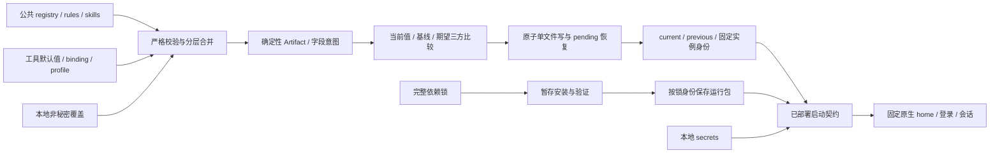

# 架构与状态边界

`config/schema/merge` 处理稳定 ID、严格字段、来源、数组替换和对象合并。SecretStore 与普通配置分开，渲染/摘要/快照不能接收秘密存储。配置源受信任但不执行本地脚本；原生 JSON/YAML 使用序列化器。

`adapter/render/skills` 生成非秘密字节和字段期望，不读取当前原生配置。`deployment` 用基线 B、当前 C、期望 D 三方合并；保留漂移不等于接受新基线。字段编码器显式注册，未知格式失败。DSL-specific patch/认证字段由 DSH adapter 负责。

`storage` 固定目录句柄、逐段 no-follow、写前复查、同目录临时文件和原子 replace。只读可信源与私人写入目标有不同权限边界。路径检查和实例锁不构成抵抗同用户任意代码的 OS 沙箱，不能宣称跨文件/外部进程的绝对原子性。

状态中的 owner 跨首次 rollback 保留，防止另一个机器文件接管尚有运行数据的实例。current 保存字段基线和非秘密启动契约，previous 只保留上一操作的必要受管前值，pending 只在事务/恢复期间存在。首次创建字段文件时记录必要的父容器存在信息，回滚可移除空的新文件，但不会删除未知空对象或新增 OAuth 字段。

`dependencies` 显式解析 npm 完整锁，sync 只执行 frozen ci 与经过哈希核对的 helper 权限修复。安装成功验证后才激活目录；配置 rollback 不降级软件或数据库。`runtime` 使用已部署 argv/引用、实时 secret 值与显式环境清单，子进程继承活动锁 fd，管理器先退出也不会立即解锁仍活动的原生宿主。

管理器是仓库应用，uv 使用 `package=false`；入口从已准备的 `.venv` 加载当前仓库 src，不额外解析未锁定的构建后端。不会通过 `uv run` 或无版本 npx 暗中安装。
