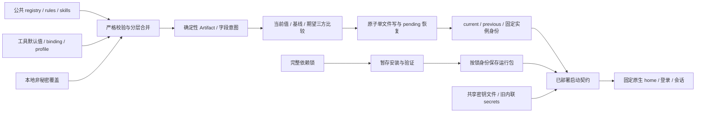
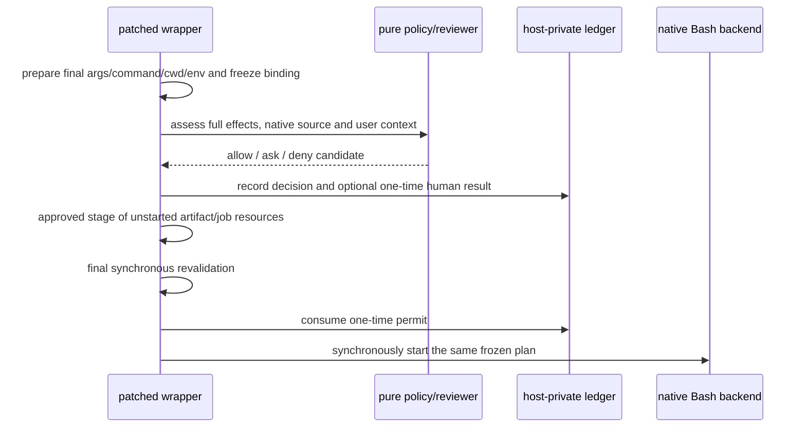

# 架构与状态边界

当前有两个入口：`agentcfg` 管理 DSH、Pi、OMP 的独立实例，`termcfg` 管理终端公开配置及其自有 mihomo 服务。Codex CLI 是 Pi 委托后端，不是 `workspace.ADAPTER_TYPES` 中的独立适配器。

## 基本原则：上游宿主保持原样

自 2026-09-30 起，所有 agent 集成都不得修改上游源码、宿主 vendor/缓存副本或官方二进制，
也不通过补丁重编译、运行时 monkey patch 或私有实现接缝扩展宿主。允许的边界是官方配置、
公开插件/扩展 API、官方 CLI 和本仓库自己的管理与适配代码。公开接口不支持的能力必须明确
说明并调整设计，不能为实现功能维护宿主 fork。该原则覆盖当前及未来全部 agent，
见[宪章第六项](../.specify/memory/constitution.md#vi-不修改任何-agent-的上游源码)和[工程约定](../AGENTS.md)。

下文的 OMP 补丁架构是原则生效前的历史交付，本机日常部署已按后续明确授权迁移到官方运行包与独立插件；
仓库实现、隔离验收与本机部署分别见[OMP 验收](acceptance/omp-permission-control.md)。其它历史宿主改动须另行盘点，
本轮不自动改动其它 agent 的部署。

## 代码阅读入口

| 子系统 | 入口与主要职责 |
| --- | --- |
| 命令与工作区 | `cli.py` → `commands.py` → `workspace.py`；选择配方、读取显式来源、构建 adapter/backend。 |
| 配置与产物 | `config.py`、`schema.py`、`merge.py` → `render.py`；严格校验、来源追踪、非秘密产物。 |
| 部署与恢复 | `deployment.py`、`native_projection.py`、`storage.py`；三方比较、所有权、受管字段备份、pending 恢复。 |
| 依赖与运行 | `backends.py`、`runtime.py`、`process.py`；按适配器选择依赖后端，验证已部署契约并启动。 |
| 工具适配 | `dsh.py`、`pi.py`、`omp.py` 与同前缀模块；原生格式、认证引用、来源与生命周期限制。 |
| Pi 委托与验证 | `pi_supervisor.py`、`pi_delegate*.py`、`pi_validation*.py`；运行监督与独立分层证据。 |
| 终端配置 | `src/termcfg/cli.py` → `preview.py` / `transaction.py`；预览、备份、写入和恢复；`packages.py` / `mihomo.py` 单独处理依赖与服务。 |

上表中未带目录的 Python 文件位于 `src/agentcfg/`。公共命令的扩展契约见 [适配器说明](adapters.md)；不是所有工具都支持全部可选钩子。当前部分原生引用守卫仍集中在公共部署层，新增适配器时应检查其原生分类，不能只实现渲染就认为已接入完整恢复边界。

```mermaid
flowchart LR
  Git[公共 registry / rules / skills] --> Resolve[严格校验与分层合并]
  Agent[工具默认值 / binding / profile] --> Resolve
  Local[本地非秘密覆盖] --> Resolve
  Resolve --> Render[确定性 Artifact / 字段意图]
  Render --> Plan[当前值 / 基线 / 期望三方比较]
  Plan --> Apply[原子单文件写与 pending 恢复]
  Apply --> State[current / previous / 固定实例身份]
  Lock[完整依赖锁] --> Sync[暂存安装与验证]
  Sync --> Runtime[按锁身份保存运行包]
  State --> Run[已部署启动契约]
  Runtime --> Run
  Secrets[共享密钥文件 / 旧内联 secrets] --> Run
  Run --> Native[固定原生 home / 登录 / 会话]
```

`config/schema/merge` 处理稳定 ID、严格字段、来源、数组替换和对象合并。`shared/defaults/models.toml` 为所有 profile 提供官方模型默认层；providers/models 去重追加，显式角色覆盖默认角色，其他数组仍整体替换。`secret_files` 从共享私人文件构造 SecretStore，兼容旧内联凭据并拒绝非空重复来源。SecretStore 与普通配置分开，渲染/摘要/快照不能接收秘密存储。配置源受信任但不执行本地脚本；原生 JSON/YAML 使用序列化器。

`adapter/render/skills` 生成非秘密字节和字段期望，不读取当前原生配置。`deployment` 用基线 B、当前 C、期望 D 三方合并；保留漂移不等于接受新基线。字段编码器显式注册，未知格式失败。DSL-specific patch/认证字段由 DSH adapter 负责。

`storage` 固定目录句柄、逐段 no-follow、写前复查、同目录临时文件和原子 replace。只读可信源与私人写入目标有不同权限边界。路径检查和实例锁不构成抵抗同用户任意代码的 OS 沙箱，不能宣称跨文件/外部进程的绝对原子性。

状态中的 owner 跨首次 rollback 保留，防止另一个机器文件接管尚有运行数据的实例。current 保存字段基线和非秘密启动契约，previous 只保留上一操作的必要受管前值，pending 只在事务/恢复期间存在。首次创建字段文件时记录必要的父容器存在信息，回滚可移除空的新文件，但不会删除未知空对象或新增 OAuth 字段。

`DependencyBackend` 分发到 DSH npm、Pi 配方切片或 OMP standalone 后端。`sync` 消费既有完整锁，只执行声明的安装/构建与校验步骤，安装成功验证后才激活目录；配置 rollback 不降级软件或数据库。`runtime` 使用已部署 argv/引用、实时 secret 值与显式环境清单。普通宿主继承活动锁 fd；Pi 另通过监督者维护实例与工作区活动证据；OMP 同实例普通会话使用共享租约，配置修改使用独占租约。

管理器是仓库应用，uv 使用 `package=false`；入口从已准备的 `.venv` 加载当前仓库 src，不额外解析未锁定的构建后端。不会通过 `uv run` 或无版本 npx 暗中安装。

## OMP permission-control 历史补丁架构（已退休）

`omp-kernel` 的权限候选由两部分组成：仓库本地 TypeScript 扩展保存纯策略、reviewer、会话命令和
审计逻辑；OMP v18.3.0 补丁在宿主内提供 bridge、私有 ledger、真实 wrapper/Bash executor 接缝及
installed-only tiny 服务。构建器把固定共享 core 文件逐字节复制到 patched host，扩展入口拿不到
ledger、真实 UI 记录能力或任意 backend start callback。loader 依据实际入口、插件树、ABI 和运行包
身份绑定注册；扩展自报字符串不能取得执行权限。其它 profile 继续选择 official runtime，不要求补丁
锁，也不注册 `/permission-control`。

受管 Bash 请求的时序如下：

```mermaid
sequenceDiagram
  participant W as patched wrapper
  participant P as pure policy/reviewer
  participant L as host-private ledger
  participant B as native Bash backend
  W->>W: prepare final args/command/cwd/env and freeze binding
  W->>P: assess full effects, native source and user context
  P-->>W: allow / ask / deny candidate
  W->>L: record decision and optional one-time human result
  W->>W: approved stage of unstarted artifact/job resources
  W->>W: final synchronous revalidation
  W->>L: consume one-time permit
  W->>B: synchronously start the same frozen plan
```

`prepare` 在任何批准前完成无副作用的最终参数和目标快照；原生 deny、command prompt、critical 与
未知来源仍优先。模型 allow 只是候选，宿主继续验证真实用户消息来源、逐 effect 引文绑定、固定风险
下限、generation、目标和运行身份。需要 artifact/job 的默认 auto-background 路径只在批准后 stage；
stage 不执行命令。最终 revalidate、permit consume 和 native start 位于同一同步临界区，其间没有
await、命令重写或扩展回调。取消、配置/目标漂移或 stage 失败会撤销 permit、清理未启动资源并保持
backend 为零。

每个主会话把 Bash 从审查开始到 backend 发起串行化；排队请求不能继承上一请求的许可、cwd 或用户
授权。`/permission-control smart|manual|status|explain` 通过独立控制输入处理，取消和模式切换是
out-of-band：它们递增 generation 并立即使 pending/permitted 请求不可执行，不等待挂起的 provider
或 worker 返回。已经启动的原生进程只按原生取消机制处理，不声称撤回已发生副作用。自动 30 秒预算
从宿主开始构造上下文时计时；主审和可选 tiny 合用同一预算，人工等待不计入。

首版目标是 Linux glibc x64 主 OMP 会话的 native Bash。用户已选择兼容现有 kernel 默认设置：
纯 interceptor 未命中不再造成笼统人工，命中仍返回原无执行引导；auto-background 保留 artifact、
等待阈值、后台结果和取消语义；Bash 冷 snapshot 先经本次人工初始化，随后只有实际 Shell、生成输入、
snapshot 内容、相关名称/options 和状态连续性均可证明时才进入智能路径；direnv auto 的完整搜索链
证明没有有效配置时可继续。状态漂移、未知 mutation 或动态加载仍转人工。

service/显式 async/PTY/ACP、实际 direnv/devenv、prefix、useUserShell、内部 URL、未知启动脚本、
未核实 worktree rewrite 以及非 Bash、eval、MCP、task/child/子代理不获得 smart permit；它们保留
原生保护、人工或无 UI 阻止。该控制属于同一进程可信边界和应用级审批，不是 OS 沙箱，也不能抵抗
同用户恶意代码或填补批准到系统调用之间的外部文件竞态。

## 验证与支持声明

Python 隔离测试、TypeScript mock、原生宿主验收和真实账号/服务验收是不同层级。历史 spec 关闭只覆盖其固定候选、平台和范围，源码或锁变化后不能沿用为新候选通过证明。当前支持边界分别见 [DSH 验收](acceptance.md)、[Pi 支持矩阵](acceptance/pi-support-matrix.md)、[OMP 支持状态](omp-support.md)、[termcfg 验收](termcfg-acceptance.md)。

CI 独立运行 Python 隔离测试和 Task Keeper 的显式 Node mock 清单。后者先以 `npm ci --ignore-scripts --prefix tests/fixtures/pi/tooling` 消费 fixture 锁，再执行 `node agents/pi/packages/task-keeper/scripts/test-mock.mjs`，由该入口建立临时 HOME 和网络/进程边界。类型检查所需的独立开发依赖锁仍待整理，见 [REVIEW-F02](follow-ups/taskkeeper-typecheck.md)；mock 通过不代表 `tsc` 已通过。
