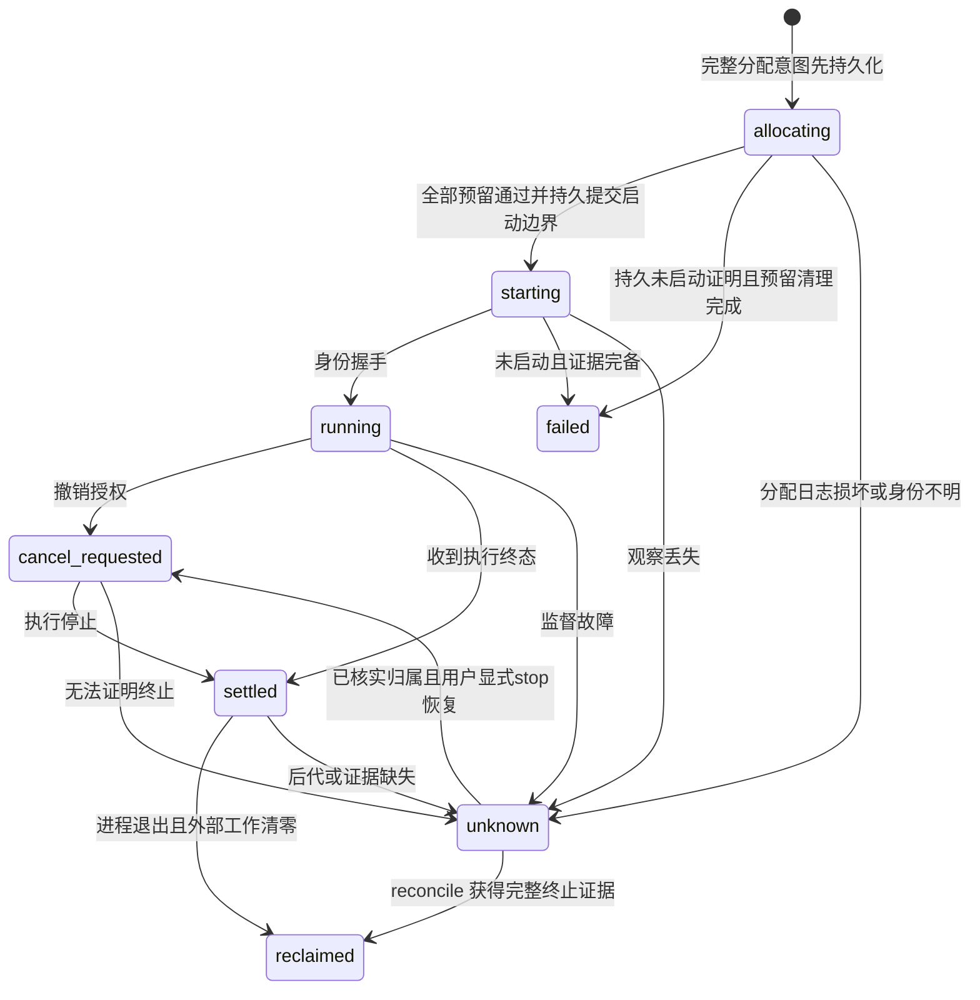

# Phase 1 Data Model

**Version**: 1；本文件定义待实现的数据契约。公共来源与持久记录使用 snake_case，
Pi 原生字段名由 adapter 转换，不把原生任意字段透传进公共模型。

## 1. Capability 与 CapabilityProfile

| 实体 | 字段 | 不变量 |
|---|---|---|
| Capability | id、kind、source_id、entrypoints、requires、conflicts、control_domain、supported_engines、evidence_cases | ID 唯一，依赖有向图无环；所选项不能存在未解决冲突 |
| CapabilityProfile | id、agent=pi、engine、capability_ids、resource_ids、model_bindings、machine_bindings、identity | 基线 pi-default/pi-managed；可选 pi-codex/pi-cursor；engine 和锁切片一致 |
| SourceIdentity | kind、upstream_url/commit/version、source_tree_digest、vendor_digest、license_files、transform_id | 来源身份覆盖内容与执行意图；机器绝对路径不能成为发布依赖 |
| MigrationItem | id、source_id、selection_state、disk_state、load_evidence、execution_evidence、disposition、target_id、reason、dependencies | 六种处置之一：keep/adapt/merge/replace/optional/exclude，证据缺失不能省略 |
| MigrationSnapshot | schema_version、source_revision、observed_at、config_digests、items、proposal_digest | 不含原秘密值、认证正文、会话正文；私人路径单独保护 |

profile 可选集是显式完整数组，禁止将缺失与空数组合并成同一语义。
由能力选项生成的原生资源清单必须包含实际加载 entrypoint，不仅包名。

## 2. 配置、角色与机器绑定

| 实体 | 字段与关系 |
|---|---|
| ModelBinding | role_id → model_id → provider_id；关联 protocol、remote_id、credential_ref 或原生 auth owner |
| ResourceDefinition | id、kind、repo_path、scope、digest、executable_intent、override；role 另含 model_role、tools、read_roots、write_roots、nested |
| MachineRoot | id、absolute_path、purpose=project/read/write、ownership_policy；仅机器覆盖中包含具体路径 |
| CheckBinding | id、executable、args、project_root、timeout_seconds、foreground；受管检查另含 kind、parser、minimum_tests、inputs，测试必须有实际计数；由可信用户配置，不接受模型新增命令 |
| NetworkRoute | id、mode、proxy_url、provider_ids、credential_ref；无默认为原机端口的行为 |
| EffectivePolicy | policy_digest、execution_mode、role_or_instance_ceiling、inherited_denials、grant_kind、grant、read_roots、write_roots、allowed_tools、nested=false |
| CredentialReferenceTarget | native_selector、expected_env_token、secret_ref、auth_owner、projection_guard_id |

模型引用必须属于所选集合。受管角色不得使用 native fuzzy matching；未绑定为配置错误。
有效权限取交集；无法编译的拒绝规则导致预检失败，不允许“尽力继承”。
凭据目标只允许精确生成的 `$ENV` token；验证当前值后才允许产生投影或备份。
公共摘要可以包含引用身份，不能包含 secret 值、原始认证头或带密码 URL。

## 3. DependencyLock 与 RuntimeReceipt

| 实体 | 必需字段 |
|---|---|
| PiLock | schema_version=1、adapter_version、recipe_digest、sources、profile_slices、toolchains、platforms、build_steps、resource_manifest、compatibility、identity |
| LockedSource | 由 sources 映射键标识；kind=npm/git/local/asset 和 license_files 必需。npm：package/version/resolved/integrity；local/git：package/version/source_path/source_tree_digest/archive_digest/vendor_path（git 另含 commit）；asset：url/platform/archive_digest/archive_member/target，vendor_path 可选 |
| BuildStep | id、platform、source_ids、argv、input_digests、expected_outputs；默认无网络、不能含凭据 |
| ProfileSlice | profile_id、engine、source_ids、package_json_digest、package_lock_digest、entrypoint、resource_manifest_digest、capability_ids、identity |
| RuntimeReceipt | lock_identity、slice_identity、platform、toolchain_observed、build_output_digests、file_receipts、status、created_at |

每个切片有独立完整 package.json/package-lock.json，根锁索引汇总各文件摘要及非 npm 归档。
`runtime_identity = digest(lock_identity, slice_identity, platform, toolchain_identity)`；
启动契约保存这个组合身份，backend.root/status 以它定位历史运行包，不按当前配置重算。
运行安装路径不参与跨机器语义身份。
平台构建结果可以有不同 byte digest，但必须对应相同源锁和各自平台的构建收据。
`status`：absent → staging → installed；核验失败转 damaged，修复另起 staging 后激活。
repair pending 不属于配置上一版备份；不会替换固定账号 home。

## 4. ManagedInstance、Deployment 与 ExecutionLease

ManagedInstance 保留工具/profile 所有者、固定 instance_id、pi_home、user_home、
可选 codex_home、current/previous/pending 与 activity control 路径。

Deployment 复用现有字段基线和非秘密启动契约，增加 Pi 的 policy/resource/slice/runtime identity
及该版本 credential_reference_allowlist；current/previous/pending 各自保留其允许引用以支持轮换。
previous 仅保存上一轮受管前值；RUNTIME/PACKAGE 内容不进入配置快照。

ExecutionLease 字段：

- instance_id、lease_id、manager_activation_id、owner_nonce、supervisor_activation_id、supervisor_process_identity。
- task_id（普通操作可空）、execution_id、parent_execution_id、kind=host/worker/check/codex/external。
- lock_identity、slice_identity、policy_digest、candidate_digest。
- process_identity、process_group_identity、control_channel_identity。
- state、last_sequence、stop_requested_at、termination_evidence、active_external_work_ids、grant_generation、workspace_write_lease_ids。
- allocation_id、planned_workspaces、allocation_journal_digest、spawn_committed；allocating阶段process_identity=null，
  启动意图已提交但尚无可靠进程身份时继续保留null与保护，不伪造PID。

ProcessIdentity 按平台包含 boot 身份、PID、开始时间与 PGID；Linux 另记 namespace，
macOS 由受版本记录的 helper 读取 start seconds/microseconds。只比较 PID 不足以认领进程。

只有 reclaimed 或证明从未启动的 failed 可释放变更保护。任务结果成功与 lease reclaimed 分开，
UI stopped 不直接写 reclaimed。未知状态必须保留，不以 TTL 清理。
新supervisor可以在同实例认证后只读核对持久旧owner的lease；旧nonce不用于新执行，
旧lease不转移到新激活，只有证实从未启动/完整终止才释放，否则继续unknown。
新StopRecoveryGrant只在旧supervisor失效及用户明确请求后授予stop，不授予旧任务继续执行权限。

### StopRecoveryPlan 与 StopRecoveryGrant

计划含schema_version=1、旧supervisor/manager激活与进程身份、目标lease/process/external work/workspace lease集合、
grant_generation、plan_kind=stop_execution/abort_allocation、allocation_journal_digest、plan_digest
与created_at/expires_at；有效期300秒，相关身份变化即stale。
授权含recovery_id、request_id、requested_action=stop、requester_uid、新supervisor激活、
plan_digest、目标lease、revocation_generation、state与evidence_refs。
state=authorized/stopping/verified/stale/unknown；仅撤销/停止，不能dispatch/resume。
保存不可变source-plan/分配证据及旧、新generation；同request幂等复用，新恢复只在目标lease的generation仍匹配时继续。
旧控制者活跃、未知归属、过期计划拒绝；重放/恢复中再崩溃按同request幂等核对。

### WorkspaceWriteLease

schema_version=1；workspace_key由host_boot_id/UID/worktree根和专属git-dir文件系统身份构成。
字段包含instance_id、execution_lease_id、task_id（可空）、attempt_id、holder_nonce、
supervisor_activation_id、grant_generation、state、termination_evidence_refs。
state=reserved/active/revoking/unknown/released；除released外阻止其他owner写入。
仲裁锁锚定既存git-dir inode，持久元数据在该git-dir的agentcfg/write-lease.json；
它是监督者拥有的运行状态，非配置备份/模型可写内容。不同profile/HOME/路径别名共用同一键。
身份和终止未知不以TTL清理；已证明未启动或完整终止才能释放。
先落盘allocating意图及全部planned_workspaces，再按键排序预留共享记录，最后提交starting边界才能spawn。
多目录不物理原子；预留/追加journal/提交边界各故障点有幂等恢复。
精确流程见 [recovery-and-workspaces.md](contracts/recovery-and-workspaces.md)。

### OperationGrant

schema_version=1、grant_id、operation_id、instance_id、issuer_activation_id、execution_mode、
allowed_tools、root_bindings、grant_generation（正整数）、issued_at、expires_at、grant_digest。
issued_at为UTC RFC3339；ordinary的expires_at可空但仅在operation与issuer有效期间成立，
delegate必须有受max_run_seconds限制的有限deadline。managed另用task grant，不能混淆两种授权。

### PermissionPolicy 与 PermissionRule

policy字段固定schema_version=1、default=deny、rules；rule使用closed file/command联合，
effect=allow/deny，tool_ids/operations非空无重复；file规则root_ref+relative_path+match=exact/subtree，
command规则只用冻结command_ref。ID为 `^[a-z][a-z0-9_-]{0,63}$`；未知字段、regex/glob/脚本不接受。
有效权限按execution_mode=ordinary/managed/delegate-readonly/delegate-write取用户policy、
角色或实例上限与OperationGrant/task grant交集，再扣除父deny与硬拒绝。
OperationGrant有operation_id而非伪造task_id；普通业务根可按授权编辑，源checkout只读仅用于候选隔离模式。
YOLO不能改变这些权限边界。
父规则变换、候选根重绑定和逐操作复核见 [permission-policy.md](contracts/permission-policy.md)。

## 5. ManagedTask、Attempt、RequestReservation

ManagedTask 复用 Task Keeper 任务库：task_id、goal、workflow=inspect/fix、candidate_id、
budget_scope_id、role_bindings、policy_digest、check_ids、required_review、second_view、state。

Attempt：attempt_id、task_id、step_id、continuation_of、idempotency_key、descriptor_digest、
manager_run_id、lease_id、candidate_snapshot_digest、state、result_receipt_id。

- Task Keeper 在 dispatch 前持久分配 attempt_id，manager 只确认并原样回显；首次 continuation_of=null。
- 相同幂等键、相同描述只返回同一 attempt；不同描述拒绝。
- resume 默认为同 task 的 fresh attempt；旧活动 execution 未关闭不得重新派发写入。
- 更改统计 group 不改变 budget_scope_id。
- 第一版不恢复旧管理者的 session ID，不自动迁移旧任务数据库。

RequestReservation：reservation_id、task_id、attempt_id、request_id、reason、turn_id、ordinal、payload_digest、
route_id、grant_digest、reserved_input_tokens、reserved_output_tokens、reserved_cost、
state=reserved/sent/settled/unknown、observed_usage_id、settled_usage。

预算存储在事务中原子预留；实际 transport.send 前复核 grant/deadline/路线。
重试产生新 request_id；仅确认从未发送才可退款，发送状态未知则保守占用额度。
provider 未提供的费用为 null；token/费用硬限额必须有保守预留上界，否则拒绝该硬限额配置。
任何 compaction/handoff/schema retry/second-view/helper 都必须说明 reason 并计入同一任务。

## 6. EvidenceReceipt 与 CapabilityEvidence

EvidenceReceipt：receipt_id、task_id、step_id、attempt_id、manager_run_id、candidate_digest、
request_digest、runtime_digest、policy_digest、final_artifact_digest、check_results、
requested_model、observed_model（可空）、terminal_status、termination_confirmed、external_work_empty、sequence_complete。

成功至少要求本次非空结果、当前候选、完整事件及终止证据；检查通过和模型结论分开。
观察不到实际模型时不伪造 observed_model；明确请求的模型不匹配则拒绝。
get_result 不消费；consume 后可按保留策略处理 manager 镜像，Task Keeper 已接管的证据独立保留。

CapabilityEvidence：capability_id、test_case_id、level=mock/native/live、identity、platform、
started_at、finished_at、status=passed/failed/not-run、artifact_refs、limitations。
identity 覆盖锁、角色、策略、运行时和相关机器契约；不匹配为 stale，不继承旧版 passed。

### AcceptanceScope 与 AcceptanceItem

AcceptanceScope含scope_id/revision/digest、目标平台/架构/profile/transport、必需/所选可选能力及证据层级。
不可因失败或缺机器/账号自动缩小；改变scope使旧批准失效。
AcceptanceItem含capability_id、scenario_id、identity、applicability=required/selected_optional/not_selected、
evidence_paths（相对evidence-root的显式文件清单）、evidence_refs及展示status=passed/failed/not-run/stale/not-selected。
候选构建前AcceptanceItem.identity可为null，汇总为not-run并阻止批准；候选冻结后必须更新为完整身份。
原始CapabilityEvidence仍只记录passed/failed/not-run；not-selected是选择状态，不是执行通过证据。
零证据也能汇总；交付批准只在所有required/selected_optional有匹配通过证据时成立。
范围内必需backend软件验证与可选真实账号验证分开，见 [evidence-and-release.md](contracts/evidence-and-release.md)。

## 7. OneShotSchedule

字段：schedule_id、task_id、due_at、deadline、state、admitted_at、idempotency_key。
state：scheduled → admitted → executed；也可 canceled/expired/paused-missed。
原子更新 admitted_at 后才能发出 dispatch；退出后不唤醒，重启错过时间进入 paused-missed，
用户显式恢复仍沿用原 task budget。外部新管理者 scheduling 关闭，避免两次触发。

## 8. ModelDelegationRun 与统一结果协议

ModelDelegationRun为单次外部执行：run_id、attempt_id、backend=pi/codex、mode、preset、
request_digest、requested_model、cwd/worktree_identity、context_artifact_id、policy_digest、
runtime_identity、lease_id、parent_dispatch_id、state、resume_token、continuation_of。
模型工具只允许只读；显式implement需要Codex写能力、用户授权和独立worktree。
任何尝试都不能回退到codex-delegate；旧角色名仅存在于迁移映射。

状态为starting/running/start_unknown/completed/failed/canceled/timeout/unknown，
物理lease是否reclaimed独立判断。start_unknown不得自动重发；resume建立新run并指向旧run，
核对旧执行已终止和权限一致。poll cursor由run_id和事件seq构成，不能跨run使用。

DelegateReceiptV2统一Pi/Codex：schema_version=2、request/运行身份、backend终态、
final_artifact_id/digest、sequence_complete、process_terminated、resources_reclaimed、
requested_model/observed_model、usage及feedback_dispositions。字段不借旧runner凭证填充。
context/feedback使用artifact_id、turn、候选快照关联；事实状态为
verified/provisional/disputed/stale/unverified，schema通过不代表事实验证通过。

DelegateBatch仅是上层批次引用：batch_id、parent_owner、dispatch_ids、result_refs、state。
model-delegate不拥有另一队列，fanout客户端只提交/查看/取消manager拥有的批次并汇总匹配结果。
最终协议细节见 [model-delegation.md](contracts/model-delegation.md)。

## 9. 持久化与版本边界

- 公共来源：TOML/Markdown/模板与锁，不含机器秘密。
- 私人 cache：盘点提案、位置映射、渲染字节和诊断摘要，0600/0700。
- 私人 state：部署 current/previous/pending、lease、监督证据，不保存秘密值。
- 原生 runtime：账号、会话、Task Keeper 数据与成果单独管理；配置回滚不回滚它们。
- 所有新记录有 schema_version；未知版本拒绝，不能自动修复或清空。
- 核心 DSH state schema 保持可读；Pi 新字段使用版本化启动契约，旧 DSH 路径不要求迁移。

### ExecutionBoundary 与 ExecutionPolicy（2026-09-17）

- execution_boundary由backend确定：pi=agentcfg-tools、codex=native-sandbox；与只读/写入execution_mode分离。
- execution_policy冻结boundary、file_policy及Codex专属native_execution={allow_shell:boolean, tool_network:"none"}，并包含configuration_admission="official-cli-restricted-v1"。该版本标识覆盖所选官方CLI的受限配置准入，不代表同进程原子配置绑定。
- execution_policy_digest覆盖完整快照，进入DelegationRequest/Receipt身份匹配与resume约束；模型不提供这些字段。
- 原生授权记录schema_version=1，绑定run_id、lease_id、request_digest、runtime_identity、execution_policy_digest、
  grant_generation、cwd、编译后的permissions及authorization_digest，存于supervisor所有的native-authorizations。
- 认证原生结果必须存在当前授权记录；结果快照不是逐工具操作日志，不证明沙箱外从未发生写入。
- 旧V2缺执行边界字段时不自动补齐、认证或恢复，记录保留；升级后创建显式新运行。

### NativeRootLimits（冻结机器根与候选投影）

execution_policy对Codex新增必填root_limits，包含bindings、readonly_roots、denied_roots。
bindings按MachineRoot ID保存canonical path、目录身份摘要与purpose；project另存worktree/git-dir/common-dir的路径和身份。
运行时重新读取声明根与Git锚点，身份或声明变化使execution_policy_digest变化并请求停止旧执行。
同一common-dir内的候选继承源checkout对应限制；不同Git项目不进行相对路径重绑定。目录别名按设备/inode/UID身份辅助匹配。
该结构没有启动/终止boot证明；真正进程与工作区租约身份仍来自原有supervisor契约。
新快照缺失不能默认为无限制；旧运行包按旧冻结契约保留，当前入口不自动升级旧授权。
