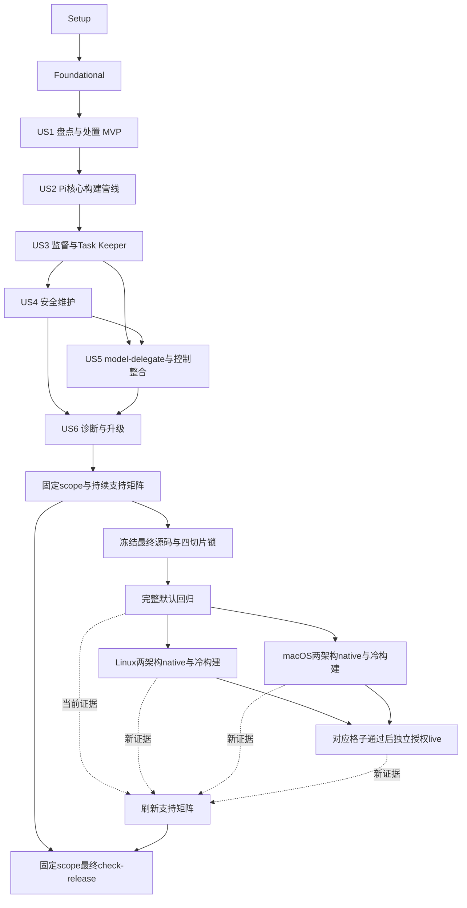

# Tasks: Pi 能力统一与跨机器迁移

**Input**: [spec.md](spec.md)、[plan.md](plan.md)、[research.md](research.md)、[data-model.md](data-model.md)、[接口契约](contracts/cli-and-configuration.md)、[验证矩阵](validation-matrix.md)

**Prerequisites**: 设计已完成；执行前读取全部contracts及[宪章](../../.specify/memory/constitution.md)。原生/账号验收还须对应独立授权；新增恢复/工作区、权限和证据契约也属于必读输入。

**Tests**: 规格FR-040、SC及V01—V24明确要求隔离与分层验证，因此包含测试任务。先写会暴露缺失行为的契约/负向测试，再实现；不能用不存在模块的导入错误代替有意义的失败断言。

**Organization**: 按6个用户故事和其优先级组织；原计划112项，2026-09-24范围修订转出5项，当前有效107项，实施状态以各任务勾选为准。US5虽为P2，model-delegate替换是完整交付必需项，不能省略。

## 当前验收范围（2026-09-24 用户最终决定）

本 spec 正常验收并完成，不再处于暂停状态。T107—T111 已转出本 spec，未来工作见 [独立后续清单](../../docs/follow-ups/pi-platform-and-live-validation.md)。当前有效任务为 T001—T106 和修订后的 T112，共 107 项，107/107 已完成。生产 check-release 返回 0，见 [关闭报告](../../docs/acceptance/pi-spec-closure-20260924/README.md)。

验收基线为 Linux x86_64 四配方 mock/native 及双路径冷重建，精确保留原矩阵中符合平台和层级条件的全部 81 项。原四平台/live 364 项报告及未验证事实保留；转出不算执行通过。完整依据见 [范围修订](scope-change-20260924.md)。

以下依赖表、FR/V 映射和原计划数量中对 T107—T111 的引用仅保留历史追溯，不再构成本 spec 的执行依赖；对应覆盖已转至后续清单。

## Codex 接法实施修订（2026-09-17）

按用户“继续”采用[原生CLI评估结论](codex-execution-reassessment.md)，权限/委托契约与数据模型已同步两种执行边界。
T074/T075以显式原生授权和沙箱投影准入，T079以原生授权/事件/候选/终止证明验证Codex结果，T088覆盖新边界负向场景。
T084/T086保留Pi受控工具与managed逐动作控制，不要求重建Codex原生工具栈。
MCP原型不进入默认Codex运行链。任务数量与勾选保持实际完成状态，不能以mock替代native证据。

## Format: `[ID] [P?] [Story] Description`

- 每项只有一个checkbox和唯一T编号；US阶段必须有对应[US1]—[US6]标签。
- [P]只表示在已列前置条件全部完成后，可与同一波次、不同文件的任务并行；不授权自动启用多个Agent。
- 每项列出精确目标路径、FR/V覆盖和必要显式依赖。未写显式依赖时继承阶段入口；无[P]的同组件任务按编号顺序执行。
- checkbox只在该项实现和要求的验证实际完成后勾选。编写测试、生成CI文件或缺授权标not-run均不代表相应验收完成。报告任务可在证据不全时完成；可选live分类的not-selected仅表示该项不适用，不是测试通过。

## Path Conventions

- 任务内路径均相对于仓库根。`src/agentcfg/`为公共管理，`agents/pi/`为适配及插件，`shared/skills/model-delegate/`为统一技能。
- 迁移来源是用户指定的starter目录；以source-baseline冻结身份，后续读取源文件但不修改源环境。
- 若任务列包入口文件，其范围包括该完整包的必需相对引用/许可证/运行资源，不仅复制入口。任务目标子文件是计划位置，不表示目前存在。
- 只有本文件在本轮任务生成中写入；以下代码、锁、配置与证据文件均为实施阶段目标。

## Execution Boundaries

- 默认测试：仓库/临时HOME、网络阻断、假宿主/模型/子进程、文件哨兵；不启动Pi/DSH/Codex，不读取原账号或会话正文。
- `lock`/`sync`真实依赖下载是明确实现验证步骤，和默认测试分开；本次生成任务不执行它们。
- native必须独立用户授权与--allow-host；live另需具体账号/项目/能力授权和--allow-live。权限缺失保留任务未完成，不跳过后宣称完整。
- 所有Pi工件在source-only阶段可留在未启用的构建/测试清单；未完成实现不能通过假包/空适配器或临时删掉必需能力让公开profile显示就绪。
- US2先用完整fixture锁证明后端/部署契约，US3/US5/US6完成后统一生成最终vendor与真实锁。中间产物不作为交付身份。
- 后续变动使源码/策略/依赖身份改变时，只重跑受影响场景并使旧证据stale；不能复用不匹配证据。

## Phase 1: Setup (Shared Infrastructure)

**Goal**: 冻结输入与验证入口，不重新初始化现有项目。

**Independent Test**: 来源身份可追溯，默认测试只使用临时HOME和替身。

**Dependencies**: 无；只读确认现有工作区和设计。

- [X] T001 记录starter固定提交、Pi0.84.4、新管理者0.19.0固定提交、Node24.14.0/npm11.19.1及可选Bun1.4.0/Codex0.154.0的输入身份；保留原目录，摘要不能含机器秘密；路径：`agents/pi/migration/source-baseline.json`、`agents/pi/NOTICE.md`。（覆盖：FR-001, FR-007, FR-009, V01, V03）
- [X] T002 扩展临时HOME/DSH_HOME/XDG及Pi/Codex目录哨兵、网络阻断和进程替身，验证fixture自身不会执行第三方宿主；路径：`tests/conftest.py`、`tests/test_pi_test_boundaries.py`。（覆盖：FR-017, FR-040, V06）（依赖：T001）
- [X] T003 建立Node插件默认mock测试入口，拦截Pi/Codex启动及外部网络；禁止把旧Task Keeper含真实PTY/RPC的入口直接作为默认npm test；路径：`scripts/test-pi-mock.mjs`、`tests/fixtures/pi/fake-host.mjs`。（覆盖：FR-040, V04）（依赖：T002）
- [X] T004 定义版本化验收记录schema，逐字落实“level=mock/native/live”“status=passed/failed/not-run”“不匹配为 stale，不继承旧版 passed”，保留命令、身份与局限；同时定义AcceptanceScope/AcceptanceItem，applicability=required/selected_optional/not_selected；原始证据仍passed/failed/not-run，报告可显示stale/not-selected，不把选择状态当执行证据；路径：`agents/pi/schemas/evidence.schema.json`、`tests/test_pi_evidence_schema.py`、`agents/pi/schemas/acceptance-scope.schema.json`、`agents/pi/schemas/acceptance-item.schema.json`。（覆盖：FR-035, FR-039, FR-040, FR-042, V18, V20, V21）（依赖：T003）

**Checkpoint**: 来源身份可追溯，默认测试只使用临时HOME和替身。

---

## Phase 2: Foundational (Blocking Prerequisites)

**Goal**: 实现所有故事共用的严格schema、版本化状态与投影保护；不得提前注册假Pi适配器。

**Independent Test**: 旧DSH配置、未知字段拒绝、秘密投影与历史启动契约回归通过。

**Dependencies**: Phase 1全部完成；本阶段完成前不开始用户故事。

- [X] T005 [P] 先增加公共契约失败用例：未选pi-managed缺绑定不阻塞DSH、未知字段仍失败、旧launch记录可读、凭据轮换合法但字面secret在快照前拒绝；路径：`tests/test_pi_core_contracts.py`。（覆盖：FR-005, FR-012, FR-017, FR-038, V02, V06, V08）
- [X] T006 [P] 定义Capability/CapabilityProfile/SourceIdentity与Pi资源catalog的closed schema，逐字落实“ID 唯一，依赖有向图无环；所选项不能存在未解决冲突”“来源身份覆盖内容与执行意图；机器绝对路径不能成为发布依赖”及agent=pi、engine与切片一致；路径：`agents/pi/schemas/catalog.schema.json`、`agents/pi/schemas/agent.schema.json`。（覆盖：FR-002, FR-005, FR-012, FR-014, V01, V02）
- [X] T007 [P] 定义完整Pi agent_options及external_skills/policies/external_tools绑定schema，逐字落实“role_id → model_id → provider_id”“purpose=project/read/write”“nested=false”；资源kind=role/prompt/theme/extension、scope=global/project、model_role只引用模型角色、model/model_role互斥，limits正整数/费用十进制字符串/数组整体替换；按contracts/permission-policy.md实现schema_version=1/default=deny、closed file/command规则，effect=allow/deny、exact/subtree、精确tool_ids/command_ref及ID/路径约束；拒绝regex/glob/脚本/未知字段；按Permission Policy第0节绑定四种execution_mode，普通OperationGrant与managed task grant分型，不把原checkout硬拒绝应用于ordinary业务根；OperationGrant使用契约closed字段与UTC期限，ordinary空expires_at只在operation/issuer存活期间有效，delegate有限deadline，不与task grant混用；路径：`agents/pi/schemas/options.schema.json`、`agents/pi/schemas/resources.schema.json`、`agents/pi/schemas/permission-policy.schema.json`、`agents/pi/schemas/operation-grant.schema.json`。（覆盖：FR-008, FR-011, FR-012, FR-014, FR-029, V02, V13）
- [X] T008 拆分全部profile结构/已提供引用校验与仅所选profile的必需绑定检查；保持空数组false、DSH错误行为和公共roles→model语义，不因新Pi配方默认未绑定而破坏现有命令；路径：`src/agentcfg/config.py`、`src/agentcfg/schema.py`。（覆盖：FR-005, FR-011, FR-012, FR-038, V02）（依赖：T005、T006、T007）
- [X] T009 扩展可选backend.runtime_identity及版本化LaunchSpec/持久记录，逐字落实“runtime_identity = digest(lock_identity, slice_identity, platform, toolchain_identity)”；旧记录回落lock_identity，运行/doctor/回滚读取保存身份而非当前profile；路径：`src/agentcfg/backends.py`、`src/agentcfg/adapter.py`、`src/agentcfg/runtime.py`、`src/agentcfg/commands.py`。（覆盖：FR-005, FR-010, FR-021, FR-042, V08, V21）（依赖：T008）
- [X] T010 实现声明式credential projection guard，在plan/apply/rollback/capture快照前检查apiKey只为精确生成$ENV token；逐字落实“previous 仅保存上一轮受管前值；RUNTIME/PACKAGE 内容不进入配置快照”，按candidate/current/previous/pending各自allowlist支持轮换并脱敏拒绝字面值/命令/组合模板；路径：`src/agentcfg/native_projection.py`、`src/agentcfg/deployment.py`。（覆盖：FR-017, FR-020, FR-021, FR-037, V06, V08）（依赖：T009）
- [X] T011 保护HOME/XDG/PI_CODING_AGENT_DIR/PI_CODING_AGENT_SESSION_DIR/CODEX_HOME及bridge/grant变量；秘密按执行者最小注入；公有非秘密诊断仅含location_id，保持0/2/3/4/5/6退出码；路径：`src/agentcfg/config.py`、`src/agentcfg/process.py`、`src/agentcfg/__main__.py`。（覆盖：FR-010, FR-017, FR-018, FR-036, V04, V06）（依赖：T010）
- [X] T012 运行基础契约与既有配置/部署/运行/秘密定向回归，记录真实结果和失败修复；证明未选新profile不影响DSH且无真实HOME/网络/宿主访问；路径：`tests/test_pi_core_contracts.py`、`docs/acceptance/pi-foundation.md`。（覆盖：FR-005, FR-017, FR-038, FR-040, V02, V06, V08）（依赖：T011）

**Checkpoint**: 旧DSH配置、未知字段拒绝、秘密投影与历史启动契约回归通过。

---

## Phase 3: User Story 1 - 确定完整能力基线与迁移决策 (Priority: P1) — MVP

**Goal**: 提供安全的来源盘点、差异和最终处置清单，覆盖补查的model-delegate及七角色替换。

**Independent Test**: 对含重复来源、用户独有资源、旧包残留和敏感哨兵的fixture产生完整提案，旧源不变，无需启动宿主。

**Dependencies**: Phase 2全部完成；不依赖其他用户故事。

### Tests for US1

- [X] T013 [P] [US1] 先写迁移盘点/能力矩阵契约用例，区分来源声明、当前选择、磁盘存在、加载证据和运行证据；禁止将目录存在计为已验证，覆盖无权限读取、重复/旧来源与秘密哨兵；路径：`tests/test_pi_inventory.py`。（覆盖：FR-001, FR-002, FR-003, FR-004, FR-006, V01）
- [X] T014 [P] [US1] 先写七角色模板化、model-delegate替换与逐包处置测试，检查依赖无环、无未决必需项、current-only implement不丢失及原生/框架字段不同处理；路径：`tests/test_pi_capability_manifest.py`。（覆盖：FR-002, FR-003, FR-004, FR-006, FR-032, FR-046, V01, V24）
### Implementation for US1

- [X] T015 [US1] 实现MigrationItem/MigrationSnapshot schema与读写，逐字落实“六种处置之一：keep/adapt/merge/replace/optional/exclude，证据缺失不能省略”“不含原秘密值、认证正文、会话正文；私人路径单独保护”，未知schema_version拒绝；路径：`agents/pi/schemas/migration.schema.json`、`src/agentcfg/pi_inventory.py`。（覆盖：FR-001, FR-002, FR-003, FR-017, V01, V06）（依赖：T013、T014）
- [X] T016 [US1] 冻结全部20个初始包来源、5个调查技能来源→4个目标技能、12提示、11主题、两普通/三受管角色及额外/禁用资源的逐项处置；记录旧七角色→preset映射与排除理由，不把旧文档数量当完整文件清单；路径：`agents/pi/migration/capabilities.toml`、`agents/pi/migration/role-map.json`。（覆盖：FR-001, FR-002, FR-003, FR-004, FR-006, FR-032, FR-046, V01, V24）（依赖：T015）
- [X] T017 [US1] 实现starter/显式旧Pi-home只读收集、实际入口引用与摘要比对，只解析允许字段/目录元数据；不读取auth/trust/session正文、不执行旧Lua或shell同步器，未知加载/执行状态保持not-run；路径：`src/agentcfg/pi_inventory.py`。（覆盖：FR-001, FR-003, FR-007, FR-017, FR-019, V01, V07）（依赖：T016）
- [X] T018 [US1] 实现与目标能力baseline的差异和非秘密机器覆盖提案，保留用户定制/旧合并策略差异，输出私人0600文件和脱敏摘要；逐项追溯配置→依赖→执行→结果，不直接采纳为部署基线；路径：`src/agentcfg/pi_inventory.py`、`agents/pi/schemas/migration-proposal.schema.json`。（覆盖：FR-002, FR-004, FR-019, FR-020, V01, V07）（依赖：T017）
- [X] T019 [US1] 接入plan --from-pi-home PATH [--from-starter PATH]参数与只读分支，拒绝单独from-starter；此路径不要求尚未实现的Pi runtime，也不注册空PiAdapter；普通plan及DSH行为不变；路径：`src/agentcfg/cli.py`、`src/agentcfg/commands.py`。（覆盖：FR-010, FR-019, FR-036, FR-038, V04, V07）（依赖：T018）
- [X] T020 [US1] 运行US1隔离测试，记录来源/能力/旧新行为映射和架构复用/扩展决定；输出可供用户审阅的提案示例，逐项确认旧环境未写入与所有必需能力有后续验收任务；路径：`docs/pi-migration.md`、`docs/acceptance/pi-inventory.md`。（覆盖：FR-001, FR-002, FR-003, FR-004, FR-005, FR-006, FR-019, V01, V07）（依赖：T019）

**Checkpoint**: 对含重复来源、用户独有资源、旧包残留和敏感哨兵的fixture产生完整提案，旧源不变，无需启动宿主。

---

## Phase 4: User Story 2 - 在新机器上构建同一套能力 (Priority: P1)

**Goal**: 实现Pi配置/资源生成、独立依赖后端和受控加载，提供跨路径构建基础。

**Independent Test**: 使用完整fixture切片在两组临时路径验证validate→render→plan→sync→apply→run假宿主；完整真实配方在后续源码收敛后验收。

**Dependencies**: Phase 2和US1能力baseline；本阶段使用隔离fixture锁，最终真实锁不得先于US3/US5/US6源码完成。

### Tests for US2

- [X] T021 [P] [US2] 先写Pi配置/原生投影契约测试：主模型未绑定普通bootstrap可部署但任务拒绝、managed缺绑定返回2、$ENV凭据、未知/同名角色、empty/false、外部catalog及agent参数不匹配无副作用；路径：`tests/test_pi_adapter.py`。（覆盖：FR-008, FR-010, FR-011, FR-012, FR-014, FR-017, V02, V04, V06）
- [X] T022 [P] [US2] 先写独立Pi锁与切片安装契约测试，使用fixture完整package.json/package-lock.json，覆盖传递缺包/归档摘要/原生必要入口/损坏修复/历史runtime身份；安装器为替身；路径：`tests/test_pi_dependencies.py`。（覆盖：FR-007, FR-009, FR-010, FR-042, V03, V04, V08）
- [X] T023 [P] [US2] 先写加载前factory过滤、已选资源发现、远程安装禁用、CLI参数保护及引擎选择测试，使用假SDK并断言旧home和未声明项目扩展不能参与；路径：`agents/pi/runtime/tests/resource-loader.test.ts`。（覆盖：FR-013, FR-014, FR-015, FR-016, FR-018, V04, V05）
### Implementation for US2

- [X] T024 [US2] 编写真实Pi adapter元数据、协议/认证绑定、插件依赖/冲突与closed资源catalog；公共content仅登记rules/skills，注册默认选择和机器外部根/工具/策略ID，不编造可用私有服务；路径：`agents/pi/agent.toml`、`agents/pi/bindings.toml`、`agents/pi/plugins.toml`、`agents/pi/content.toml`。（覆盖：FR-008, FR-011, FR-012, FR-014, V02, V05）（依赖：T021、T022、T023）
- [X] T025 [US2] 定义pi-default/pi-managed/pi-codex/pi-cursor完整配方及机器示例，不引入隐式继承；逐字落实“profile 可选集是显式完整数组，禁止将缺失与空数组合并成同一语义”；model-delegate在最终普通配方必需，Cursor/Bun与Node managed互斥；路径：`profiles/pi-default.toml`、`profiles/pi-managed.toml`、`profiles/pi-codex.toml`、`profiles/pi-cursor.toml`、`examples/pi-workstation.toml`。（覆盖：FR-006, FR-008, FR-011, FR-012, FR-023, FR-031, V02, V17）（依赖：T024）
- [X] T026 [US2] 依据baseline迁入3个完整领域技能、11主题、12提示和规则，保留许可证、相对引用/执行意图；implement普通父实施→fresh reviewer，managed路由kernel_task；旧Codex调用先转换声明的目标模板引用，不带入旧技能；路径：`shared/skills/cpp-database-kernel/SKILL.md`、`shared/skills/neovim-plugin-development/SKILL.md`、`shared/skills/safe-linux-scripting/SKILL.md`、`agents/pi/migration/resource-manifest.json`、`agents/pi/prompts/implement.md`、`agents/pi/themes/Everforest Dark.json`。（覆盖：FR-007, FR-013, FR-014, FR-016, V01, V05）（依赖：T025）
- [X] T027 [US2] 实现PiAdapter validate/render/managed_targets/launch_spec：字段叶子/完整资源/初始化/运行时/包五类所有权、精确模型映射和实例home；逐字落实“模型引用必须属于所选集合。受管角色不得使用 native fuzzy matching；未绑定为配置错误。”；路径：`src/agentcfg/pi.py`、`agents/pi/templates/AGENTS.template.md`、`agents/pi/templates/APPEND_SYSTEM.template.md`、`agents/pi/templates/keybindings.template.jsonc`（结构化 settings/角色头部由序列化器生成，不经文本模板求值）。（覆盖：FR-005, FR-008, FR-010, FR-011, FR-012, FR-013, FR-017, FR-018, V02, V04, V05, V06）（依赖：T026）
- [X] T028 [US2] 实现PiLock/LockedSource/ProfileSlice/RuntimeReceipt schema，逐字落实“schema_version=1”“kind=npm/git/local/asset”“默认无网络、不能含凭据”“status：absent → staging → installed”；损坏为damaged，recipe/资源/构建/平台身份入锁，各切片保存独立完整npm文件对；路径：`schemas/pi-lock.schema.json`、`agents/pi/schemas/runtime-receipt.schema.json`。（覆盖：FR-009, FR-042, V03, V08）（依赖：T027）
- [X] T029 [US2] 实现确定性vendor构建器，锁源git SHA/本地源树/执行位/许可证和派生补丁，必要构建argv与输出hash allowlist；开发使用fixture，拒绝starter绝对路径和全局node_modules作为发布输入；路径：`scripts/build-pi-vendor.py`、`agents/pi/build/recipes.json`。（覆盖：FR-007, FR-009, FR-013, V03）（依赖：T028）
- [X] T030 [US2] 实现PiBackend显式lock解析及每profile完整npm锁生成，root manifest索引各切片；禁止sync时裁剪或重写总锁，固定基线工具链，不改变DSH锁策略；路径：`src/agentcfg/pi_dependencies.py`、`agents/pi/dependencies.json`。（覆盖：FR-005, FR-007, FR-009, FR-010, V03, V04）（依赖：T029）
- [X] T031 [US2] 实现frozen npm ci --ignore-scripts、批准构建步骤、private staging/安装HOME、完整收据校验、原子激活与repair pending；失败保留旧runtime及账号，正文核验不以mtime/marker替代；路径：`src/agentcfg/pi_dependencies.py`、`src/agentcfg/pi_runtime_packages.py`。（覆盖：FR-009, FR-010, FR-018, FR-021, V03, V08）（依赖：T030）
- [X] T032 [US2] 实现封闭Pi loader：已安装清单路径、factory前过滤、显式项目资源、受管角色同名冲突、禁native updater/package自动安装、实际loaded_manifest摘要；普通业务读取不受资源发现关闭影响；路径：`agents/pi/runtime/resource-loader.ts`、`agents/pi/runtime/launch.ts`。（覆盖：FR-007, FR-013, FR-014, FR-015, FR-016, FR-018, V04, V05）（依赖：T031）
- [X] T033 [US2] 注册完成的PiAdapter/PiBackend，扩展run pi和lock --agent pi及agent/profile一致性；run/doctor等使用保存runtime_identity、保留argv语义但拒绝破坏HOME/loader/模型/工具或动态-e的参数；模型未绑定允许登录UI但拒绝任务派发；路径：`src/agentcfg/workspace.py`、`src/agentcfg/cli.py`、`src/agentcfg/commands.py`、`src/agentcfg/runtime.py`。（覆盖：FR-005, FR-010, FR-018, FR-036, FR-038, V02, V04, V08）（依赖：T032）
- [X] T034 [US2] 接通fixture角色/技能/模板发现与两路径mock全命令流；验证profile切片不误选Bun/Codex、必需缺包返回5、缺secret返回3、未绑定返回2；真实配方缺待迁入源码必须明确not-ready，不用占位包掩盖；路径：`tests/test_pi_pipeline.py`、`tests/test_pi_resource_discovery.py`。（覆盖：FR-006, FR-007, FR-008, FR-009, FR-013, FR-018, V03, V04, V05）（依赖：T033）
- [X] T035 [US2] 回归显式锁命令、无网络配置命令、损坏运行包拒绝启动/修复和原生参数冲突；记录fixture与真实认证的区别；路径：`tests/test_pi_dependencies.py`、`tests/test_pi_adapter.py`、`docs/acceptance/pi-pipeline-mock.md`。（覆盖：FR-009, FR-010, FR-036, FR-040, V03, V04, V08）（依赖：T034）

**Checkpoint**: 本故事代码/契约和mock达到上述独立标准；最终运行包和 Linux x86_64 原生证据由 Phase 9 闭合。其他平台与账号 live 已转出本 spec，不由本检查点宣称通过。

---

## Phase 5: User Story 3 - 在新子代理体系中完成受管长任务 (Priority: P1)

**Goal**: 实现唯一管理者、平台监督与Task Keeper新集成，使预算、权限、结果和终止构成可验证闭环。

**Independent Test**: 用假模型/受控进程接口验证十类任务场景；物理平台与真实Pi运行另有显式验收任务，不将mock计为原生通过。

**Dependencies**: Phase 2、US1基线、US2核心管线；不依赖US5外部委托实现。

### Tests for US3

- [X] T036 [P] [US3] 先写监督与ExecutionLease契约测试：starting先落盘、父退出、PID复用、未知子活动、新监督者只读核对旧owner、cancel不释放锁及跨实例控制拒绝；增加旧控制者失效后显式stop恢复、过期计划/重放/恢复中再崩溃，以及两个profile/不同HOME/路径别名争同worktree恰一个成功、未知租约阻塞和不同worktree可并行；增加allocating意图落盘前后、每项共享预留后/追加journal前/starting提交前后及回收中故障注入；只有未提交启动边界的完整记录允许abort_allocation；路径：`tests/test_pi_activity.py`、`tests/test_pi_control_recovery.py`、`tests/test_pi_workspace_leases.py`。（覆盖：FR-018, FR-022, FR-028, FR-043, V09, V13, V14, V22）
- [X] T037 [P] [US3] 先写managed桥接全操作/未知字段/幂等/双监听者/描述符变化/候选变化/GC与consume契约失败用例，不导入真实宿主；路径：`agents/pi/runtime/tests/managed-bridge.test.ts`。（覆盖：FR-015, FR-023, FR-024, FR-025, FR-028, V10, V11, V14）
- [X] T038 [P] [US3] 先写请求预算/权限/调度集成失败用例：首次/重试/压缩/helper/proxy请求、unknown退款、父deny/动态工具/路径越界及调度重发，默认使用假transport；覆盖Permission Policy v1逐样例匹配：src不匹配src2、父.env拒绝重绑定候选、deny顺序无关、rename两端、command argv变化及不可转换父规则零执行；加入ordinary授权根写入成功且不需要task grant、managed写源checkout失败、readonly delegate始终不能写和模式不可由模型伪造的对照用例；路径：`agents/pi/packages/task-keeper/tests/agentcfg-policy.test.ts`。（覆盖：FR-026, FR-027, FR-029, FR-030, V12, V13, V15）
### Implementation for US3

- [X] T039 [US3] 定义ExecutionLease/ProcessIdentity与持久转换，包含“task_id（普通操作可空）”“kind=host/worker/check/codex/external”；逐字落实“只有 reclaimed 或证明从未启动的 failed 可释放变更保护”“未知状态必须保留，不以 TTL 清理。”；定义StopRecoveryPlan/Grant及WorkspaceWriteLease，计划300秒有效期、requested_action=stop、state=authorized/stopping/verified/stale/unknown；写租约state=reserved/active/revoking/unknown/released，工作区键含host/UID/worktree与专属git-dir身份；ExecutionLease先allocating持久化完整planned_workspaces/process_identity=null/spawn_committed=false，预留齐备再持久starting/true；StopRecoveryPlan包含plan_kind与allocation_journal_digest；路径：`src/agentcfg/activity.py`、`agents/pi/schemas/execution-lease.schema.json`、`agents/pi/schemas/stop-recovery.schema.json`、`agents/pi/schemas/workspace-write-lease.schema.json`。（覆盖：FR-018, FR-022, FR-028, FR-043, V09, V14, V22）（依赖：T036、T037、T038）
- [X] T040 [US3] 实现私有监督端点/owner认证/先登记后spawn和持锁；按recovery-and-workspaces契约保留只读reconcile，另实现计划核对、旧监督者死亡证明、显式用户recover_stop及仅停止授权，原子撤销旧generation；实现git-dir inode仲裁与0700/0600持久WorkspaceWriteLease，跨profile共享、未知不清锁、额外根按键排序预留；不为部署杀用户进程；纠正写前顺序为allocating意图→共享reserved→持久starting提交→spawn；abort_allocation核对旧控制者失效和未启动证明后幂等撤销匹配预留，不以记录缺失推定从未启动；RecoveryGrant保存首次授权不可变证据及旧/新generation，仅作用于目标lease；重放/再崩溃复用同授权，不重复增代或误拒自身撤销变化；路径：`scripts/pi-supervisor.py`、`src/agentcfg/activity.py`、`agents/pi/runtime/supervisor-client.ts`、`src/agentcfg/workspace_leases.py`。（覆盖：FR-018, FR-022, FR-028, FR-043, V09, V13, V14, V22）（依赖：T039）
- [X] T041 [P] [US3] 实现Linux boot/start ticks/namespace/进程组身份、bwrap verifier与revoke→TERM→KILL→wait/外部工作清零；非前台/daemon脱离仍保持unknown，停止只作用于确认拥有的执行；路径：`src/agentcfg/activity_linux.py`、`scripts/pi-project-check`、`tests/test_pi_activity_linux.py`。（覆盖：FR-022, FR-025, FR-028, FR-029, FR-039, V09, V13, V14）（依赖：T040）
- [X] T042 [P] [US3] 实现macOS libproc PID/PPID/PGID/start time身份helper、nonce管道与sandbox-exec验证器策略；记录clang/SDK/helper身份，不模拟/proc或将缺能力标支持；进程系统调用使用替身测试；路径：`scripts/pi-supervisor-macos.c`、`src/agentcfg/activity_macos.py`、`agents/pi/runtime/sandbox-macos.sb`、`tests/test_pi_activity_macos.py`。（覆盖：FR-022, FR-025, FR-028, FR-029, FR-039, V09, V13, V14）（依赖：T040）
- [X] T043 [US3] 将run主进程、子worker、验证命令纳入监督，变更命令检查未完成/unknown lease；PI_HOME固定，父退出不丢子活动，启动/变更竞争使用同一实例原子准入；接入recover pi --lease ID与显式--stop --expect-plan DIGEST，读取保存实例/lease身份而不要求当前模型/secret/新runtime就绪；writer/可写check在spawn前原子取得跨实例WorkspaceWriteLease，变更命令不隐式执行stop；路径：`src/agentcfg/runtime.py`、`src/agentcfg/commands.py`、`src/agentcfg/activity.py`。（覆盖：FR-018, FR-022, FR-028, FR-043, V09, V14, V22）（依赖：T041、T042）
- [X] T044 [US3] 从冻结来源完整迁入Task Keeper源码/角色/技能/检查逻辑，目标0.2.0-agentcfg.1；拆分默认mock与真实宿主测试，删除旧0.63依赖/prepare运行时补丁路径但保留需要移植的契约，不改真实starter；路径：`agents/pi/packages/task-keeper/package.json`、`agents/pi/packages/task-keeper/NOTICE.md`、`agents/pi/packages/task-keeper/scripts/test-mock.mjs`。（覆盖：FR-007, FR-013, FR-023, FR-024, FR-040, V03, V10）（依赖：T043）
- [X] T045 [US3] 实现固定新版管理者的managed-executor-v1 vendor补丁，只有一个AgentManager；普通session与managed-process后端共用队列，关闭scheduling/workflows/nesting/bypassQueue，worker不加载第二管理者；路径：`agents/pi/packages/subagents-patch/managed-executor.patch`、`agents/pi/packages/subagents-patch/manifest.json`。（覆盖：FR-015, FR-023, FR-024, FR-030, V10, V15）（依赖：T044）
- [X] T046 [US3] 实现桥接closed描述符/事件schema及Task/Attempt模型；逐字落实“workflow=inspect/fix”“首次 continuation_of=null”“Task Keeper 在 dispatch 前持久分配 attempt_id，manager 只确认并原样回显”；owner=instance/activation/nonce、事件seq单调/event_id去重，模型/路径/role身份不可覆盖；将workspace_write_lease_ids/workspace_identity_digest/grant_generation加入写入描述符和准入摘要，readonly数组可空，writer不能为空；路径：`agents/pi/runtime/managed-types.ts`、`agents/pi/packages/task-keeper/src/contracts/agentcfg.ts`。（覆盖：FR-024, FR-025, FR-028, FR-043, V10, V11, V13, V14, V22）（依赖：T045）
- [X] T047 [US3] 实现handshake/preflight/dispatch/inspect及持久幂等，preflight不执行模型；token绑定descriptor/runtime/slice/policy/deadline；零/多监听者、过期准入、模糊模型或未知角色拒绝，重复键异内容拒绝；路径：`agents/pi/runtime/managed-bridge.ts`、`agents/pi/packages/task-keeper/src/adapters/subagents.ts`。（覆盖：FR-015, FR-023, FR-024, FR-028, V09, V10）（依赖：T046）
- [X] T048 [US3] 实现fresh受管worker的封闭loader、实例最小env与模型/路线预检；只加载声明工具和证据回报；不加载任意父插件/MCP/shell，未认证transport及外部model_delegate请求启动前拒绝；路径：`agents/pi/runtime/managed-worker.ts`、`agents/pi/packages/task-keeper/src/adapters/runtime-identity.ts`。（覆盖：FR-017, FR-018, FR-023, FR-024, FR-029, V10, V13）（依赖：T047）
- [X] T049 [US3] 编译EffectivePolicy并迁移guarded工具/角色根校验，逐字落实「有效权限取交集；无法编译的拒绝规则导致预检失败，不允许“尽力继承”。」；按原文含义检查role_ceiling/inherited_denials/task_grant，动态注册/YOLO不能扩权，writer排除.git/源checkout；使用Permission Policy v1唯一规则语言与父规则转换表，实际路径组件/对象身份匹配、project根候选重绑定、deny优先/默认拒绝，工具动作前复查policy/root/alias/grant摘要和workspace写租约；managed固定候选与task grant；ordinary另按业务worktree/OperationGrant编译，内置源checkout禁写限定候选隔离模式，所有写入仍需workspace租约；路径：`agents/pi/packages/task-keeper/src/adapters/child-reporter.ts`、`agents/pi/runtime/permission-policy.ts`、`agents/pi/packages/task-keeper/agents/task-keeper-reader.md`、`agents/pi/packages/task-keeper/agents/task-keeper-writer.md`、`agents/pi/packages/task-keeper/agents/task-keeper-reviewer.md`。（覆盖：FR-011, FR-024, FR-029, FR-034, FR-043, V13, V22）（依赖：T048）
- [X] T050 [US3] 实现RequestReservation原子账本，逐字落实“state=reserved/sent/settled/unknown”“重试产生新 request_id；仅确认从未发送才可退款，发送状态未知则保守占用额度”“provider 未提供的费用为 null”；硬token/费用无保守上界时拒绝，统计group不改budget_scope_id；路径：`agents/pi/packages/task-keeper/src/store/request-ledger.ts`、`agents/pi/packages/task-keeper/src/contracts/requests.ts`。（覆盖：FR-026, FR-027, V12）（依赖：T049）
- [X] T051 [US3] 在实际transport.send前复核grant/deadline/route与reservation；覆盖直接/代理、重试/schema修复/压缩/second_view/父helper请求，关闭worker自主重试和多重恢复；无未计量fallback，限流等待本身不算发送；路径：`agents/pi/packages/task-keeper/src/adapters/http-transport.ts`、`agents/pi/packages/task-keeper/src/adapters/child-reporter.ts`。（覆盖：FR-026, FR-027, FR-034, V12）（依赖：T050）
- [X] T052 [US3] 实现EvidenceReceipt持久化/验证/get_result/consume，逐字落实“observed_model（可空）”“get_result 不消费”；当前candidate、非空结果、连续事件与终止/外部清零全部关联，未consume不可GC，检查通过与模型结论分开；路径：`agents/pi/packages/task-keeper/src/contracts/evidence.ts`、`agents/pi/runtime/managed-results.ts`。（覆盖：FR-025, FR-028, FR-033, V11, V14）（依赖：T051）
- [X] T053 [US3] 迁移inspect/fix、候选worktree、trusted foreground argv真实检查和required review，修改candidate使旧检查失效；第二视角明确绑定且有界，原checkout不自动合并，writer上限1/readers1/总children2；路径：`agents/pi/packages/task-keeper/src/orchestration/service.ts`、`agents/pi/packages/task-keeper/src/workspace/worktree.ts`、`agents/pi/packages/task-keeper/src/verification/supervisor.ts`。（覆盖：FR-025, FR-029, FR-031, V11, V13）（依赖：T052）
- [X] T054 [US3] 实现cancel/reconcile与逻辑queued/running/waiting/paused/blocked/completed/failed/canceled，区分物理lease；resume为同task fresh attempt、旧活动未结不能重写、不迁移旧session，保留预算/候选/审计；显式recover_stop不得恢复旧任务执行权；旧控制者仍活跃/目标身份未知/计划过期拒绝，恢复中再崩溃幂等核对，只有完整终止才释放execution与workspace两种租约；恢复覆盖尚未spawn的预留事务：allocating完整且提交位false可abort；starting后无PID/日志损坏仍unknown，不误释放；路径：`agents/pi/packages/task-keeper/src/orchestration/recovery.ts`、`agents/pi/runtime/managed-bridge.ts`。（覆盖：FR-022, FR-026, FR-027, FR-028, FR-043, V09, V12, V14, V22）（依赖：T053）
- [X] T055 [US3] 迁移OneShotSchedule，逐字落实“scheduled → admitted → executed；也可 canceled/expired/paused-missed”“原子更新 admitted_at 后才能发出 dispatch”；退出不唤醒、重启错过暂停，用户恢复仍沿用原task预算；路径：`agents/pi/packages/task-keeper/src/orchestration/scheduler.ts`。（覆盖：FR-026, FR-030, V15）（依赖：T054）
- [X] T056 [US3] 接通/orch、kernel_task、kernel-orchestrate及三角色/second_view绑定，用户控制与模型控制分权，managed缺模型/检查返回2、缺能力返回5，初始关闭不计为迁移完成；路径：`agents/pi/packages/task-keeper/index.ts`、`agents/pi/packages/task-keeper/skills/kernel-orchestrate/SKILL.md`、`examples/pi-managed.toml`。（覆盖：FR-011, FR-023, FR-024, FR-025, FR-028, FR-030, FR-031, V10, V11, V15）（依赖：T055）
- [X] T057 [US3] 运行单管理者、十类生命周期与预算/权限/证据/终止负向测试，记录两平台模拟与原生未执行的区分；验证资源未回收时绝不返回完成且阻止配置变更；加入控制者崩溃后的显式停止闭环、跨profile工作区争用与全部权限规则样例；不得仅验证旧owner只读查询或单实例writer计数；路径：`agents/pi/packages/task-keeper/tests/agentcfg-policy.test.ts`、`agents/pi/runtime/tests/managed-bridge.test.ts`、`tests/test_pi_activity.py`、`docs/acceptance/pi-managed-mock.md`、`tests/test_pi_control_recovery.py`、`tests/test_pi_workspace_leases.py`。（覆盖：FR-022, FR-023, FR-024, FR-025, FR-026, FR-027, FR-028, FR-029, FR-030, FR-031, FR-040, FR-043, V09, V10, V11, V12, V13, V14, V15, V22）（依赖：T056）

**Checkpoint**: 本故事代码/契约和mock达到上述独立标准；其最终运行包、原生及账号通过证据仍须Phase 9闭合，不能将该检查点称为完整迁移。

---

## Phase 6: User Story 4 - 安全切换与日常维护 (Priority: P1)

**Goal**: 在统一部署流程中保护用户定制、账号、运行数据和活动任务，支持安全capture与回滚。

**Independent Test**: 临时实例故障注入/三方冲突/凭据轮换/跨profile哨兵全部符合退出码与恢复契约。

**Dependencies**: US1提案、US2部署管线及US3活动监督完成。

### Tests for US4

- [X] T058 [P] [US4] 先写从旧home提案到新实例采纳的旅程测试，覆盖所有权/路径/旧同步器标记/用户定制与单一写入管理者；禁止直接apply-import或执行旧同步器；路径：`tests/test_pi_migration_flow.py`。（覆盖：FR-003, FR-017, FR-018, FR-019, FR-020, V06, V07）
- [X] T059 [P] [US4] 先写每个多文件写入故障点、backup/pending、历史runtime切片、合法凭据轮换与回滚、旧snapshot非法secret的恢复用例；断言未知旧记录不静默修复；路径：`tests/test_pi_recovery.py`。（覆盖：FR-017, FR-020, FR-021, FR-022, FR-042, V06, V08, V09）
- [X] T060 [P] [US4] 先写主题/主模型allowlist捕获契约测试，未知/重复映射返回2、非秘密提案重新全量校验、不得读auth或完整models正文进入产物；路径：`tests/test_pi_capture.py`。（覆盖：FR-017, FR-036, FR-037, V06, V18）
### Implementation for US4

- [X] T061 [US4] 为Pi实例接通字段基线/完整文件/INITIALIZE/RUNTIME/PACKAGE，复用三方比较并保护未知字段；单侧漂移保留不接纳为基线，空数组false正确，不删除原生新增文件；路径：`src/agentcfg/pi.py`、`src/agentcfg/deployment.py`、`src/agentcfg/profile_runtime.py`。（覆盖：FR-018, FR-019, FR-020, FR-021, V06, V07, V08）（依赖：T058、T059、T060）
- [X] T062 [US4] 补齐Pi current/previous/pending投影guard及历史引用allowlist恢复，无变化不轮换、失败恢复/成功回滚消费备份；配置回滚不改账号/任务库/软件/数据库；路径：`src/agentcfg/native_projection.py`、`src/agentcfg/deployment.py`。（覆盖：FR-017, FR-020, FR-021, FR-042, V06, V08）（依赖：T061）
- [X] T063 [US4] 接入apply/sync/rollback与全部external lease的排他准入，父退出仍有子/旧unknown时返回4；不得杀用户进程抢锁，重启reconcile仅凭完整证据释放；只有已核实终止才能清除对应工作区持久租约；不同state_root/HOME不能导致同worktree出现两个writer；路径：`src/agentcfg/commands.py`、`src/agentcfg/pi_dependencies.py`、`src/agentcfg/activity.py`。（覆盖：FR-018, FR-021, FR-022, FR-028, FR-043, V09, V14, V22）（依赖：T062）
- [X] T064 [US4] 实现Pi capture_projection/capture_configuration，仅从选定主题/主模型读取allowlist叶子并反解已选ID；输出私人提案而非自动修改机器/Git，未知模型不自动创建公共条目；路径：`src/agentcfg/pi.py`、`src/agentcfg/commands.py`。（覆盖：FR-017, FR-036, FR-037, V06, V18）（依赖：T063）
- [X] T065 [US4] 交付新隔离实例切换、旧同步目标停止使用、来源采纳/漂移/冲突/凭据轮换/回滚操作与活动阻塞指南；旧home和原starter保持不删除，不引入全局迁移后台任务；路径：`docs/pi-migration.md`、`docs/operations.md`。（覆盖：FR-019, FR-020, FR-021, FR-022, FR-037, V07, V08, V18）（依赖：T064）
- [X] T066 [US4] 运行US4整条隔离旅程、连续两次apply、父退出子活动、符号链接和故障恢复用例；记录changed=0/backup不轮换、哨兵无非预期修改及相关退出码；路径：`tests/test_pi_migration_flow.py`、`tests/test_pi_recovery.py`、`tests/test_pi_capture.py`、`docs/acceptance/pi-maintenance-mock.md`。（覆盖：FR-017, FR-018, FR-019, FR-020, FR-021, FR-022, FR-037, FR-040, V06, V07, V08, V09, V18）（依赖：T065）

**Checkpoint**: 临时实例故障注入/三方冲突/凭据轮换/跨profile哨兵全部符合退出码与恢复契约。

---

## Phase 7: User Story 5 - 统一委托入口并完成model-delegate替换 (Priority: P2，完整交付必需)

**Goal**: 完善model-delegate、统一所有调用方与控制责任，并让旧执行器和七角色从新交付完全退出。

**Independent Test**: 在没有旧skill/runner/tool/七角色的临时环境中，以两fake backend验证十类委托场景、七preset和所有调用方。

**Dependencies**: US1处置、US2加载/锁接口、US3监督/唯一manager接口；可在US4非共享文件任务之外推进，完整集成需US4活动保护。

### Tests for US5

- [X] T067 [P] [US5] 先写ReceiptV2/请求、readonly工具及CLI契约测试，Pi/Codex共享fixture，覆盖显式backend/model、未知字段/错cwd/旧receipt/空final/错误model/伪终止拒绝；路径：`shared/skills/model-delegate/tests/test-contract-v2.sh`。（覆盖：FR-032, FR-033, FR-043, FR-044, V16, V22, V23）
- [X] T068 [P] [US5] 先写detach/ready/start_unknown、cursor/poll/wait/cancel/resume、4096字节边界、并发writer冲突与写任务不自动重试用例，禁止真实CLI执行；覆盖pi-managed与pi-codex跨实例同worktree竞争、路径别名、旧控制者死亡后的用户停止恢复及未知写租约不可被新run覆盖；路径：`shared/skills/model-delegate/tests/test-lifecycle-v2.sh`。（覆盖：FR-022, FR-028, FR-033, FR-043, FR-044, V09, V14, V22, V23）
- [X] T069 [P] [US5] 先写新Pi工具桥、七preset、batch与旧组件退出测试，验证managed上下文拒绝外部helper、无人可借task/preset提权，旧runner完全缺席仍可执行；路径：`agents/pi/packages/model-delegate/tests/bridge.test.ts`、`tests/test_pi_delegate_retirement.py`。（覆盖：FR-032, FR-033, FR-034, FR-043, FR-045, FR-046, V16, V23, V24）
### Implementation for US5

- [X] T070 [US5] 迁入完整model-delegate技能、scripts/backend/lib、schemas、references/examples和fake fixtures并登记唯一来源；吸收旧实现必要语义保留notice，禁止拷贝run-codex.sh或用wrapper隐藏依赖；路径：`shared/skills/model-delegate/SKILL.md`、`shared/skills/model-delegate/NOTICE.md`、`shared/content.toml`。（覆盖：FR-007, FR-013, FR-043, FR-045, FR-046, V03, V24）（依赖：T067、T068、T069）
- [X] T071 [US5] 实现ModelDelegationRun/DelegateReceiptV2/Context/Feedback schema，逐字落实“backend=pi/codex”“schema_version=2”“状态为starting/running/start_unknown/completed/failed/canceled/timeout/unknown”“verified/provisional/disputed/stale/unverified”；observed_model可空，字段不得借旧runner填充；请求/结果关联workspace_write_lease_ids、workspace_identity_digest和grant_generation，readonly写租约为空；与supervisor相同的工作区身份和停止证据一致；路径：`shared/skills/model-delegate/schemas/request-v2.json`、`shared/skills/model-delegate/schemas/receipt-v2.json`、`shared/skills/model-delegate/schemas/context-v2.json`、`shared/skills/model-delegate/schemas/feedback-v2.json`、`shared/skills/model-delegate/schemas/event-v2.json`。（覆盖：FR-022, FR-033, FR-043, FR-044, V16, V22, V23）（依赖：T070）
- [X] T072 [US5] 重构单run supervisor/credentials/routing，canonical state/锁定可执行/最小env/显式route，排除全局pi auth和固定代理；统一实例nonce/lease准入，standalone不自建队列，父控制重试时runner重试为零；standalone与Pi工具桥都调用公共workspace租约，不创建私有profile写锁；控制者丢失使用显式stop恢复协议，不能复活旧nonce；standalone使用delegate模式OperationGrant与同一allocating事务；不得绕过先持久意图再预留的顺序；路径：`shared/skills/model-delegate/scripts/lib/supervisor.sh`、`shared/skills/model-delegate/scripts/lib/credentials.sh`、`shared/skills/model-delegate/scripts/lib/routing.sh`、`shared/skills/model-delegate/scripts/lib/retry.sh`、`src/agentcfg/workspace_leases.py`。（覆盖：FR-017, FR-018, FR-022, FR-028, FR-033, FR-043, FR-045, V06, V09, V14, V16, V22, V23）（依赖：T071）
- [X] T073 [P] [US5] 适配Pi backend到锁定实例运行包与封闭资源，保留只读调查/审查、精确provider/model、resume/cancel和事件归一化；supports_write=false明确拒绝，不启动第二manager或读取全局账号；路径：`shared/skills/model-delegate/scripts/backends/pi.sh`、`shared/skills/model-delegate/scripts/backends/pi-normalize.jq`。（覆盖：FR-032, FR-033, FR-043, FR-045, V16, V22）（依赖：T072）
- [X] T074 [P] [US5] 适配Codex backend到锁定CLI0.154.0/实例CODEX_HOME/网络route/统一supervisor，以native-sandbox及execution_policy_digest绑定显式原生授权，保留真实执行与请求身份；不使用run-codex.sh，启动参数与宿主能力由fake和后续native分别验证；路径：`shared/skills/model-delegate/scripts/backends/codex.sh`、`shared/skills/model-delegate/scripts/backends/codex-normalize.jq`、`shared/skills/model-delegate/scripts/codex-probe.sh`。（覆盖：FR-032, FR-033, FR-043, FR-045, FR-046, V16, V22, V24）（依赖：T072）
- [X] T075 [US5] 实现Codex implement准入：explicit-write、--allow-workspace-write、--worktree-root三者齐备，验证独立linked worktree/cwd/owner与其他writer冲突；只读工具和Pi backend不能升写、写入不自动重试；写入准入必须从git-dir锚定的跨实例WorkspaceWriteLease取得唯一授权；同worktree其他profile的reserved/active/revoking/unknown均返回4，不靠本实例进程列表判空；路径：`shared/skills/model-delegate/scripts/lib/workspace.sh`、`shared/skills/model-delegate/scripts/backends/codex.sh`。（覆盖：FR-022, FR-029, FR-043, V09, V13, V22）（依赖：T073、T074）
- [X] T076 [US5] 扩展run-model.sh start/status/cancel/resume/probe及poll/wait/--detach/--observe，逐字落实“start_unknown不得自动重发”“poll cursor由run_id和事件seq构成，不能跨run使用”；ready确认前保留未知活动，wait超时不取消，resume新run必须证明旧执行终止；路径：`shared/skills/model-delegate/scripts/run-model.sh`、`shared/skills/model-delegate/scripts/lib/control.sh`。（覆盖：FR-033, FR-043, FR-044, V16, V22, V23）（依赖：T075）
- [X] T077 [US5] 实现语义checkpoint/单调seq、cursor断点和有界心跳；控制信封默认≤4096字节，长artifact私人引用；禁止公开私密推理/秘密/原始错误，心跳不推进语义cursor；路径：`shared/skills/model-delegate/scripts/lib/progress.sh`、`shared/skills/model-delegate/references/progress-protocol.md`。（覆盖：FR-017, FR-044, V06, V23）（依赖：T076）
- [X] T078 [US5] 实现结构化context与memory转换、预算裁剪和反馈关联；保留权威约束/task/candidate/turn及来源，不硬编码1M窗口；schema通过不当事实通过，缺required反馈或错artifact/候选不能接受；路径：`shared/skills/model-delegate/scripts/lib/context.sh`、`shared/skills/model-delegate/scripts/lib/feedback.sh`、`shared/skills/model-delegate/scripts/lib/memory.sh`。（覆盖：FR-033, FR-044, V16, V23）（依赖：T077）
- [X] T079 [US5] 实现两backend统一终态CAS和receipt校验，区分agentcfg-tools与native-sandbox，原生写入核验冻结授权与候选结果而不强制MCP日志：request/cwd/runtime/policy/model/非空final/连续事件/资源终止齐备才verified-execution；未知observed_model保持null，v1历史只读、跨协议resume兼容不足拒绝；路径：`shared/skills/model-delegate/scripts/lib/contract.sh`、`shared/skills/model-delegate/scripts/lib/receipt.sh`。（覆盖：FR-033, FR-043, FR-044, V16, V22, V23）（依赖：T078）
- [X] T080 [US5] 为唯一manager增加submit_delegate/get_delegate_result/cancel_delegate/submit_batch，按幂等键/owner申请external executor和supervisor；managed未认证上下文启动前拒绝，不让调用方绕过队列与工作区保护；路径：`agents/pi/packages/subagents-patch/external-executor.patch`、`agents/pi/runtime/external-executor.ts`。（覆盖：FR-015, FR-022, FR-032, FR-034, FR-045, V09, V16, V23）（依赖：T079）
- [X] T081 [US5] 实现唯一model_delegate工具桥与/model-login codex显式命令；mode=review/investigate、preset固定七种、model_role/model二选一、timeout正整数≤max_run_seconds，核验当前receipt而非信任shell退出码，不注册旧别名；路径：`agents/pi/packages/model-delegate/index.ts`、`agents/pi/packages/model-delegate/runner.ts`、`agents/pi/packages/model-delegate/package.json`。（覆盖：FR-012, FR-032, FR-033, FR-043, FR-045, FR-046, V16, V22, V24）（依赖：T080）
- [X] T082 [US5] 把七旧角色逐项转为general/context/challenge/plan/research/review/scout模板；需要Codex时明确backend，保留用途与输出要求；更新所有相关AGENTS/APPEND/skill/prompt引用，删除新发布中的七角色注册；路径：`shared/skills/model-delegate/presets/context.md`、`shared/skills/model-delegate/presets/challenge.md`、`shared/skills/model-delegate/presets/plan.md`、`shared/skills/model-delegate/presets/research.md`、`shared/skills/model-delegate/presets/review.md`、`shared/skills/model-delegate/presets/scout.md`、`shared/skills/model-delegate/presets/general.md`、`agents/pi/templates/AGENTS.md`、`agents/pi/templates/APPEND_SYSTEM.md`。（覆盖：FR-016, FR-032, FR-045, FR-046, V05, V16, V24）（依赖：T081）
- [X] T083 [US5] 将fanout重构为上层明确批次提交/查看/取消/聚合客户端，逐字落实“DelegateBatch仅是上层批次引用：batch_id、parent_owner、dispatch_ids、result_refs、state”；无manager时拒绝批量但允许单run，失败/部分结果不假报全通过；路径：`shared/skills/model-delegate/scripts/run-model-fanout.sh`、`shared/skills/model-delegate/scripts/lib/batch.sh`。（覆盖：FR-034, FR-043, FR-045, V23）（依赖：T082）
- [X] T084 [US5] 改造permission-system与session-yolo的实际策略接口，缺/坏策略拒绝而非空deny；父策略显式桥接新manager，/yolo只改允许的会话覆盖，不能放宽managed角色与task grant；footer显示真实状态；固定file/command父规则转换；无法转换时拒绝，不把原生权限包规则不加解析地透传；策略收紧使旧admission失效；ordinary工具保留明确授权的原业务worktree编辑能力，不强制不存在的候选或task_id；managed和readonly模式仍保留更窄上限；路径：`agents/pi/packages/session-yolo/index.ts`、`agents/pi/packages/colorful-footer/index.ts`、`agents/pi/runtime/permission-access.ts`、`agents/pi/packages/permission-system-vendor/src/agentcfg.ts`、`agents/pi/build/permission-system.patch`。（覆盖：FR-029, FR-034, FR-045, V13, V17）（依赖：T083）
- [X] T085 [US5] 迁移loop-guard和openai-proxy，处理handoff/btw/smart-compact辅助请求与Task Keeper责任；ordinary单一压缩者，managed只经transport gate或明确拒绝；代理失败不直连、latch不重置预算；路径：`agents/pi/packages/loop-guard/index.ts`、`agents/pi/packages/openai-proxy/index.ts`、`agents/pi/extensions/handoff.ts`、`agents/pi/runtime/capability-policy.ts`。（覆盖：FR-026, FR-027, FR-034, FR-045, V12, V17）（依赖：T084）
- [X] T086 [US5] 迁移dirty-repo-guard/exit-command/git-checkpoint/notify/gentle-agent-state并登记外部agent-report；pi-processes三扩展+skill接监督，slopchop编辑/checkpoint恢复不能碰活动候选；readseek写工具不进入readonly角色；ordinary内建write/edit/rename、外部editor、可写检查及stash/restore统一经过跨实例workspace准入；持租约父任务只能显式派生受限子操作；路径：`agents/pi/extensions/dirty-repo-guard.ts`、`agents/pi/extensions/exit-command.ts`、`agents/pi/extensions/git-checkpoint.ts`、`agents/pi/extensions/notify.ts`、`agents/pi/extensions/gentle-agent-state.ts`、`agents/pi/build/processes-supervisor.patch`、`agents/pi/runtime/ordinary-operations.ts`、`src/agentcfg/pi_operations.py`、`agents/pi/runtime/readseek-controller.ts`、`src/agentcfg/pi_readseek.py`。（覆盖：FR-013, FR-022, FR-029, FR-034, FR-043, FR-045, V05, V09, V13, V17, V22）（依赖：T085）
- [X] T087 [US5] 更新四配方/catalog/manifest的新入口及依赖闭包，列清每个调用方迁移结果；新发布无旧skill/run-codex.sh/codex-agents/工具别名/七角色可执行依赖，仅保留历史来源和负向测试字符串；旧机器不删除；路径：`agents/pi/content.toml`、`agents/pi/plugins.toml`、`agents/pi/migration/caller-map.json`、`profiles/pi-default.toml`、`profiles/pi-codex.toml`、`shared/skills/model-delegate/README.md`。（覆盖：FR-007, FR-013, FR-016, FR-032, FR-043, FR-045, FR-046, V01, V16, V24）（依赖：T086）
- [X] T088 [US5] 在旧组件完全缺席的临时环境运行两backend/七preset/全部调用方、十类委托场景及插件控制矩阵；检查write拒绝/取消未知/批次重复/旧凭证/旧路径fallback，记录缺原生与账号证据，不将源历史测试数当通过；路径：`shared/skills/model-delegate/tests/test-contract-v2.sh`、`shared/skills/model-delegate/tests/test-lifecycle-v2.sh`、`agents/pi/packages/model-delegate/tests/bridge.test.ts`、`tests/test_pi_delegate_retirement.py`、`docs/acceptance/pi-model-delegate-mock.md`。（覆盖：FR-032, FR-033, FR-034, FR-043, FR-044, FR-045, FR-046, FR-040, V16, V17, V22, V23, V24）（依赖：T087）

**Checkpoint**: 本故事代码/契约和mock达到上述独立标准；其最终运行包、原生及账号通过证据仍须Phase 9闭合，不能将该检查点称为完整迁移。

---

## Phase 8: User Story 6 - 升级与诊断仍可复现 (Priority: P2)

**Goal**: 交付就绪诊断、可选服务/引擎、升级证据失效与可执行分层验证入口。

**Independent Test**: 替换损坏/不兼容依赖及缺服务/账号的fixtures，状态与补救准确、旧证据stale、四项维护操作可复现。

**Dependencies**: US2核心管线、US3生命周期、US4维护及US5统一入口；不依赖真实账号即可完成mock。

### Tests for US6

- [X] T089 [P] [US6] 先写doctor分层/稳定错误码/location/证据过期/可选未选中契约测试；离线不得执行宿主或查账号，验证configured/deployed/dependencies/load/auth/execution分开而非单个installed；增加零证据/混合passed-failed-not-run-stale报告仍生成、scope变更撤销批准、未选与缺授权不能混淆的断言；路径：`tests/test_pi_doctor.py`。（覆盖：FR-035, FR-036, FR-039, FR-040, FR-042, V18, V20, V21）
- [X] T090 [P] [US6] 先写Cursor/Bun选择、MCP/web显式route、OpenSpec资料发现、缺服务/缺工具/未登录/未选backend测试；Node managed选Cursor失败，禁用可选项不影响主流程；路径：`tests/test_pi_optional_capabilities.py`。（覆盖：FR-008, FR-013, FR-034, FR-035, FR-036, V05, V17, V18）
- [X] T091 [P] [US6] 先写验证脚本参数/授权边界契约：tier必填、mock拒绝真实HOME/runtime、native拒绝凭据文件、live必须明确local/profile/project并拒绝all、output0600且不覆盖、退出0/1/2含义固定；新增--report-only/--check-release与--tier互斥及scope/evidence-root参数测试；不执行宿主/网络，缺失证据not-run、损坏schema报2；未选不计分母、已选无授权阻塞，报告0不等于批准0；路径：`tests/test_pi_verification_cli.py`、`tests/test_pi_release_gate.py`。（覆盖：FR-035, FR-039, FR-040, FR-041, FR-042, V18, V20, V21）
### Implementation for US6

- [X] T092 [US6] 实现CapabilityEvidence存储与identity匹配，逐字落实“level=mock/native/live”“status=passed/failed/not-run”“identity 覆盖锁、角色、策略、运行时和相关机器契约；不匹配为 stale，不继承旧版 passed。”；记录artifact refs与局限，不保留秘密原文；实现固定AcceptanceScope与AcceptanceItem选择矩阵，原始证据三态与显示五态分离；必需软件/backend替换验证不受可选账号是否选中影响，不允许因失败删范围；路径：`src/agentcfg/pi_evidence.py`、`src/agentcfg/pi_acceptance.py`。（覆盖：FR-006, FR-035, FR-039, FR-040, FR-042, V18, V20, V21, V24）（依赖：T089、T090）
- [X] T093 [US6] 实现Pi doctor及commands输出capabilities字段、bootstrap未绑定/待登录/缺必要包/未选择backend；authentication四态与load/execution证据一致，live只声明服务可达性、不得调用模型；路径：`src/agentcfg/pi.py`、`src/agentcfg/commands.py`、`src/agentcfg/pi_evidence.py`。（覆盖：FR-008, FR-035, FR-036, V18）（依赖：T092）
- [X] T094 [US6] 为MCP/web/Superpowers/pi-rules建立显式资源/服务/凭据/规则根投影及全依赖发现；禁止自动借全局账号/技能/服务与隐式执行安装脚本，可选服务进程纳入supervisor；路径：`agents/pi/runtime/service-bindings.ts`、`agents/pi/templates/mcp.json.j2`、`agents/pi/plugins.toml`、`agents/pi/agent.toml`。（覆盖：FR-007, FR-008, FR-009, FR-013, FR-014, FR-017, FR-034, V03, V05, V17）（依赖：T093）
- [X] T095 [US6] 实现锁定OpenSpec1.11.0资料/skills投影和可选backend.openspec_argv，显式project init只操作指定项目，未选/缺包明确失败；不凭npm包存在或无pi字段宣称技能已发现；路径：`src/agentcfg/pi_dependencies.py`、`src/agentcfg/project.py`、`agents/pi/runtime/openspec-resources.json`。（覆盖：FR-008, FR-010, FR-013, FR-014, FR-034, V04, V05, V17）（依赖：T094）
- [X] T096 [US6] 实现pi-cursor Bun1.4.0启动/版本身份与Cursor1.4.29独立实例登录配置，不借Node通过证据；声明与Task Keeper互斥，Bun普通manager/权限/资源发现独立校验，选择缺能力明确阻塞；路径：`agents/pi/runtime/launch.ts`、`profiles/pi-cursor.toml`、`agents/pi/bindings.toml`、`tests/test_pi_cursor_profile.py`。（覆盖：FR-008, FR-009, FR-034, FR-035, FR-039, V17, V18, V20）（依赖：T095）
- [X] T097 [US6] 实现依赖/角色/策略/路线升级差异与匹配证据stale，旧runtime按历史契约定位；任务数据库/会话不兼容需显式拒绝恢复，输出回退边界而不自动改数据；路径：`src/agentcfg/pi_evidence.py`、`src/agentcfg/pi_inventory.py`、`tests/test_pi_upgrade.py`。（覆盖：FR-021, FR-035, FR-042, V08, V21）（依赖：T096）
- [X] T098 [US6] 实现verify-pi.py的mock/native/live分层调度与所有quickstart case、报告schema和scope检查，mock网络阻断/假宿主；原生runner仅在独立明确授权和标志齐备时执行，未执行不勾通过；增加独立report-only与check-release，零证据可汇总，输出按新快照不覆盖；原生/实网未齐时仍能报告，批准只在固定scope的required/selected_optional全部匹配passed时成立；路径：`scripts/verify-pi.py`、`src/agentcfg/pi_validation.py`、`src/agentcfg/pi_validation_native.py`、`src/agentcfg/pi_validation_live.py`、`src/agentcfg/pi_acceptance.py`。（覆盖：FR-006, FR-035, FR-039, FR-040, FR-041, FR-042, V18, V20, V21）（依赖：T091、T097）〔2026-09-22重新打开：代码已修改（darwin approximate 实现标记，确保不会被误记为 passed），替身测试通过（3 个测试），但 macOS 实机验证仍缺（归 T108/T109 执行）。完整实现需要修改 helper 协议，添加只停止 owner 的命令。当前作为近似验证，记录限制。linux 行为不变，定向测试通过〕〔2026-09-23 事实更正：helper 协议已实现 OWNER 动作（`scripts/pi-supervisor-macos.c` 按出生身份+audit token 只 SIGKILL owner，owner 退出后 worker 存活并由恢复路径带收据停止），恢复替身流程已按完整语义改写；Linux 分层调度、report-only/check-release 与固定 scope 在最终候选 9d6a9270 上完成双目标冷重建全链验证（`docs/acceptance/pi-cold-9d6a9270/`）。darwin 实机缺仍归 T108/T109，不阻塞本任务的分层验收器与报告契约完成标准〕
- [X] T099 [US6] 实现cold-rebuild：每目标平台/切片两种HOME与仓库路径的新目标从真实锁显式sync，不复制参考runtime；隔离旧home/starter/cache，允许锁下载但无模型外网，逐能力记录证据和原生未执行情况；路径：`src/agentcfg/pi_cold_rebuild.py`、`src/agentcfg/pi_cold_sandbox.py`、`tests/test_pi_cold_rebuild.py`。（覆盖：FR-007, FR-009, FR-039, FR-040, FR-041, FR-046, V20, V24）（依赖：T098的mock/native调度及报告契约已就绪；执行器实现和mock可独立完成，各目标native通过仍等待该平台执行器及授权）
- [X] T100 [US6] 交付新机安装/真实模型登记/登录/Task Keeper检查绑定/model-delegate替换/可选服务与升级指南，覆盖增加技能、调整角色、切换模型、禁用插件四操作，不编辑生成产物或回旧Neovim同步；文档加入recover停止计划/显式授权命令、工作区冲突处理、Permission Policy v1样例和report-only/check-release的独立含义；路径：`docs/pi.md`、`docs/pi-migration.md`、`examples/pi-managed.toml`、`examples/pi-services.toml`。（覆盖：FR-008, FR-022, FR-028, FR-029, FR-031, FR-035, FR-036, FR-037, FR-042, FR-045, V09, V13, V18, V21, V22, V24）（依赖：T099）
- [X] T101 [US6] 运行缺依赖/服务/账号、四配方冲突、升级证据失效、capture及维护示例回归，核对记录只包含真实已执行层级与可操作补救；运行scope/报告/交付门槛负向用例并准备初始scope；本故事完成不等待native/live执行，只证明分类和门槛实现正确；路径：`tests/test_pi_doctor.py`、`tests/test_pi_optional_capabilities.py`、`tests/test_pi_upgrade.py`、`tests/test_pi_verification_cli.py`、`docs/acceptance/pi-diagnostics-mock.md`、`tests/test_pi_release_gate.py`、`docs/acceptance/pi-scope.json`。（覆盖：FR-006, FR-034, FR-035, FR-036, FR-037, FR-039, FR-040, FR-042, V17, V18, V20, V21, V24）（依赖：T100）

**Checkpoint**: 本故事代码/契约和mock达到上述独立标准；其最终运行包、原生及账号通过证据仍须Phase 9闭合，不能将该检查点称为完整迁移。

---

## Phase 9: Polish & Cross-Cutting Concerns

**Goal**: 生成最终真实依赖与资源身份，完成默认回归与 Linux x86_64 四配方原生及双路径冷构建；实网及其他三平台已转出本 spec。原目标追溯：独立授权原生/实网与四个平台冷构建，发布准确证据。

**Independent Test**: 46条FR/12项SC/24组验证在修订后的平台和层级范围内有对应记录；Linux x86_64 四配方软件范围的81项均须匹配通过，任何范围内的缺失、失败或过期证据都阻止T112完成。其他平台与live在独立后续清单及历史完整scope中保留not-run，不再构成本spec未完成任务。

**Dependencies**: US1—US6实施/mock检查点全部完成；先执行T102生成初始报告，之后按依赖执行构建和验收，证据变化重跑报告；最终锁/原生验收不能使用中间源码或fixture。

- [X] T102 依据固定scope和当前证据生成初始及持续支持矩阵，零记录/部分失败照常展示passed/failed/not-run/stale/not-selected；每批新证据重新生成快照，更新文档；本任务只代表汇总功能/报告完成，不代表功能通过，不等待后续平台或账号验收完成；路径：`docs/acceptance/pi-support-matrix.md`、`docs/acceptance.md`、`README.md`、`README.zh-CN.md`、`docs/adapters.md`、`src/agentcfg/pi_acceptance.py`。（覆盖：FR-004, FR-005, FR-006, FR-035, FR-037, FR-038, FR-039, FR-040, FR-041, FR-042, FR-046, V18, V19, V20, V21, V24）（依赖：T101）
- [X] T103 核对所有来源/转换/caller/资源manifest与最终源码及许可证一致，source目标无旧组件执行依赖；完整skills/插件引用及原生入口闭包通过，冻结本轮原生验收候选身份；把固定scope摘要关联最终候选输入；只冻结候选，不据此标平台/账号通过；路径：`agents/pi/migration/resource-manifest.json`、`agents/pi/migration/caller-map.json`、`agents/pi/NOTICE.md`、`agents/pi/build/recipes.json`。（覆盖：FR-001, FR-002, FR-004, FR-007, FR-009, FR-013, FR-016, FR-045, FR-046, V01, V03, V05, V24）（依赖：T102）
- [X] T104 在明确在线锁解析步骤生成全部真实vendor、四配方各自完整package.json/package-lock.json及根manifest，记录实际归档/构建/平台摘要；无占位hash、mutable ref或旧执行器，DSH锁保持原版本与语义；路径：`locks/pi/manifest.json`、`locks/pi/pi-default/package.json`、`locks/pi/pi-default/package-lock.json`、`locks/pi/pi-managed/package.json`、`locks/pi/pi-managed/package-lock.json`、`locks/pi/pi-codex/package.json`、`locks/pi/pi-codex/package-lock.json`、`locks/pi/pi-cursor/package.json`、`locks/pi/pi-cursor/package-lock.json`。（覆盖：FR-007, FR-009, FR-038, FR-046, V03, V24）（依赖：T103）
- [X] T105 运行完整默认pytest和verify-pi --tier mock --case all，涵盖所有故事、旧组件缺席、DSH回归和工具/profile隔离；证据记录实际命令/环境/结果，不把mock当原生通过；路径：`tests/test_pi_dsh_compatibility.py`、`docs/acceptance/pi-default-tests.md`。（覆盖：FR-017, FR-018, FR-038, FR-040, FR-043, FR-044, FR-045, FR-046, V01, V02, V03, V04, V05, V06, V07, V08, V09, V10, V11, V12, V13, V14, V15, V16, V17, V18, V19, V21, V22, V23, V24）（依赖：T104）
- [X] T106 [P] 仅在独立native授权后于Linux x86_64执行四配方原生发现、Task Keeper十类场景、model-delegate完整替换与两路径冷构建，使用虚构服务；真实安装/进程监督证据写入平台记录，未授权不得执行或勾选；路径：`docs/acceptance/pi-linux-x86_64.json`。（覆盖：FR-023, FR-024, FR-025, FR-026, FR-027, FR-028, FR-029, FR-030, FR-031, FR-039, FR-040, FR-041, FR-043, FR-044, FR-045, FR-046, V03, V05, V09, V10, V11, V12, V13, V14, V15, V16, V17, V20, V22, V23, V24）（依赖：T105）〔2026-09-22重新打开：当前源码已不匹配 32da4799 锁（recipe_digest 不匹配：当前 1be31f1c... vs 锁中 123979a7...），需要冻结新候选。只有 pi-default 有有效证据（20 passed），其他三个 profile（cursor/codex/managed）的冷重建报告属于旧候选 4c043f8f（source_digest 不匹配）。需要重新运行冷重建取得属于新候选的证据。当前 mock 测试通过（1825 passed, 325 node tests passed），但 native 证据不完整〕〔2026-09-23 接手更正：候选已推进为 ed34c4e7（recipe 4374fea4，接手时与源码匹配；原始 mock 报告实测 1836 passed+3 skipped+7 subtests、325 Node，见 pi-execution-inventory-20260923.md）。ed34c4e7 归档仅 pi-default 一目标通过、第二目标 target-preparation-failed，整档 failed。本轮为 Cursor ReadSeek 预期集/沙箱绑定等缺口修改源码，需正式 resolve_lock 冻结新候选后重跑四配方×双目标〕〔2026-09-23 完成：最终候选 9d6a9270（recipe 85fc15c3）在 Linux x86_64 独立卷上取得四配方×双全新 HOME/checkout 的完整冷安装与原生通过（含 Task Keeper 11 场景、model-delegate 全替换、两路径 ReadSeek 九工具真实调用、Codex receipt 三场景、synthetic 服务），138 条 EvidenceRecord 与 scope r2、report-only/check-release 快照归档于 `docs/acceptance/pi-cold-9d6a9270/`；正式 mock 1861 passed+7 subtests、325/325 Node、0 skipped。live 项归 T110/T111，其他平台归 T107—T109〕
- **T107：已转出本 spec，未执行**。见 [PI-F01 后续工作](../../docs/follow-ups/pi-platform-and-live-validation.md)。原验收要求保留在该清单和历史 scope；不计本 spec 未完成项。
- **T108：已转出本 spec，未执行**。见 [PI-F02 后续工作](../../docs/follow-ups/pi-platform-and-live-validation.md)。原验收要求保留在该清单和历史 scope；不计本 spec 未完成项。
- **T109：已转出本 spec，未执行**。见 [PI-F03 后续工作](../../docs/follow-ups/pi-platform-and-live-validation.md)。原验收要求保留在该清单和历史 scope；不计本 spec 未完成项。
- **T110：已转出本 spec，未执行**。见 [PI-F04 后续工作](../../docs/follow-ups/pi-platform-and-live-validation.md)。原验收要求保留在该清单和历史 scope；不计本 spec 未完成项。
- **T111：已转出本 spec，未执行**。见 [PI-F05 后续工作](../../docs/follow-ups/pi-platform-and-live-validation.md)。原验收要求保留在该清单和历史 scope；不计本 spec 未完成项。
- [X] T112 按 2026-09-24 用户修订后的 Linux x86_64 软件验收基线执行 report-only/check-release；原样复用匹配的 81 项 mock/native 证据，核对候选锁/recipe、归档摘要、quickstart 和转出记录；全部匹配通过后关闭本 spec。原完整范围报告保持不批准，不声明 live 或其他平台已通过；路径：`docs/acceptance/pi-spec-closure-20260924/`、`specs/001-unify-pi-capabilities/scope-change-20260924.md`、`docs/acceptance/pi-support-matrix.md`。（覆盖：FR-037—FR-042、FR-045—FR-046、V18—V21、V24；当前平台/层级适用部分）（依赖：T102—T106）

**Checkpoint**: 46条FR/12项SC/24组验证按修订平台/层级有对应记录；81项当前软件范围全部通过才关闭本 spec。转出的平台/live在独立后续清单保留not-run，不勾为测试通过。

---

## Dependencies & Execution Order

### Phase Dependencies

- **T001—T004**：Phase 1: Setup (Shared Infrastructure)；无；只读确认现有工作区和设计。
- **T005—T012**：Phase 2: Foundational (Blocking Prerequisites)；Phase 1全部完成；本阶段完成前不开始用户故事。
- **T013—T020**：Phase 3: User Story 1 - 确定完整能力基线与迁移决策 (Priority: P1) — MVP；Phase 2全部完成；不依赖其他用户故事。
- **T021—T035**：Phase 4: User Story 2 - 在新机器上构建同一套能力 (Priority: P1)；Phase 2和US1能力baseline；本阶段使用隔离fixture锁，最终真实锁不得先于US3/US5/US6源码完成。
- **T036—T057**：Phase 5: User Story 3 - 在新子代理体系中完成受管长任务 (Priority: P1)；Phase 2、US1基线、US2核心管线；不依赖US5外部委托实现。
- **T058—T066**：Phase 6: User Story 4 - 安全切换与日常维护 (Priority: P1)；US1提案、US2部署管线及US3活动监督完成。
- **T067—T088**：Phase 7: User Story 5 - 统一委托入口并完成model-delegate替换 (Priority: P2，完整交付必需)；US1处置、US2加载/锁接口、US3监督/唯一manager接口；可在US4非共享文件任务之外推进，完整集成需US4活动保护。
- **T089—T101**：Phase 8: User Story 6 - 升级与诊断仍可复现 (Priority: P2)；US2核心管线、US3生命周期、US4维护及US5统一入口；不依赖真实账号即可完成mock。
- **T102—T112**：Phase 9: Polish & Cross-Cutting Concerns；US1—US6实施/mock检查点全部完成；先执行T102生成初始报告，之后按依赖执行构建和验收，证据变化重跑报告；最终锁/原生验收不能使用中间源码或fixture。

### User Story Dependencies



图中虚线仅表示报告刷新事件，不是前置依赖；每个live场景只依赖自己的native格子。

**避免循环依赖**：US2的fixture锁与安装器只用于核心契约；Task Keeper和model-delegate通过同一接口开发，
不依赖尚不存在的最终vendor。US5源码与控制整合完成后，US6完善真实配方和验证入口，Phase 9才冻结所有真实归档与锁。
US2/US3/US5各自的mock检查点可独立展示，但所有所选资源连通和SC最终证明在Phase 9汇合，不能提前将其标为已完全交付。

### Within Each User Story

1. 故事入口依赖和列明的显式前置项完成后，才进入本故事。
2. 先写契约与负向用例，证明失败行为；模型/schema→服务→CLI/插件接口→集成验证顺序推进。
3. 所有data-model必填字段按对应实体实现；任务内引用的枚举/null/身份/状态约束为硬要求，不可自由选择替代语义。
4. 同路径任务串行执行；即使不同故事均可启动，也不能同时改commands.py、pi.py、runtime.py、目录manifest或同一vendor补丁。
5. mock不触发真实授权步骤；native/live缺前提时保存not-run原因并保留未勾选，不把延后当完成。

### Parallel Opportunities

- Phase 2: Foundational (Blocking Prerequisites)：T005, T006, T007；仅在各自声明依赖满足后并行。
- Phase 3: User Story 1 - 确定完整能力基线与迁移决策 (Priority: P1) — MVP：T013, T014；仅在各自声明依赖满足后并行。
- Phase 4: User Story 2 - 在新机器上构建同一套能力 (Priority: P1)：T021, T022, T023；仅在各自声明依赖满足后并行。
- Phase 5: User Story 3 - 在新子代理体系中完成受管长任务 (Priority: P1)：T036, T037, T038, T041, T042；仅在各自声明依赖满足后并行。
- Phase 6: User Story 4 - 安全切换与日常维护 (Priority: P1)：T058, T059, T060；仅在各自声明依赖满足后并行。
- Phase 7: User Story 5 - 统一委托入口并完成model-delegate替换 (Priority: P2，完整交付必需)：T067, T068, T069, T073, T074；仅在各自声明依赖满足后并行。
- Phase 8: User Story 6 - 升级与诊断仍可复现 (Priority: P2)：T089, T090, T091；仅在各自声明依赖满足后并行。
- Phase 9: Polish & Cross-Cutting Concerns：T106, T107, T108, T109；仅在各自声明依赖满足后并行。

以下并行示例是实施排程说明，不表示本轮启动子Agent或执行这些任务。

## Parallel Example: User Story 1

前提：本故事入口依赖完成。可同时编写以下不同文件的契约测试：

```text
T013 tests/test_pi_inventory.py
T014 tests/test_pi_capability_manifest.py
```

测试设计可并行；后续修改共同schema、适配器或CLI的任务按显式依赖与编号串行。

## Parallel Example: User Story 2

前提：本故事入口依赖完成。可同时编写以下不同文件的契约测试：

```text
T021 tests/test_pi_adapter.py
T022 tests/test_pi_dependencies.py
T023 agents/pi/runtime/tests/resource-loader.test.ts
```

测试设计可并行；后续修改共同schema、适配器或CLI的任务按显式依赖与编号串行。

## Parallel Example: User Story 3

前提：本故事入口依赖完成。可同时编写以下不同文件的契约测试：

```text
T036 tests/test_pi_activity.py
T037 agents/pi/runtime/tests/managed-bridge.test.ts
T038 agents/pi/packages/task-keeper/tests/agentcfg-policy.test.ts
```

监督协议稳定且T040完成后，T041、T042可在不同平台后端文件并行；共享监督/命令集成随后串行。

## Parallel Example: User Story 4

前提：本故事入口依赖完成。可同时编写以下不同文件的契约测试：

```text
T058 tests/test_pi_migration_flow.py
T059 tests/test_pi_recovery.py
T060 tests/test_pi_capture.py
```

测试设计可并行；后续修改共同schema、适配器或CLI的任务按显式依赖与编号串行。

## Parallel Example: User Story 5

前提：本故事入口依赖完成。可同时编写以下不同文件的契约测试：

```text
T067 shared/skills/model-delegate/tests/test-contract-v2.sh
T068 shared/skills/model-delegate/tests/test-lifecycle-v2.sh
T069 agents/pi/packages/model-delegate/tests/bridge.test.ts
```

单run监督契约稳定且T072完成后，T073、T074可并行；控制、receipt与工具桥等待两backend完成后推进。

## Parallel Example: User Story 6

前提：本故事入口依赖完成。可同时编写以下不同文件的契约测试：

```text
T089 tests/test_pi_doctor.py
T090 tests/test_pi_optional_capabilities.py
T091 tests/test_pi_verification_cli.py
```

测试设计可并行；后续修改共同schema、适配器或CLI的任务按显式依赖与编号串行。

## Implementation Strategy

### MVP First (User Story 1 Only)

1. 完成Setup与Foundational。
2. 完成US1：交付只读联合盘点、逐项处置、调用方映射与迁移提案。
3. 在临时样例中验证无秘密输出、旧源不变、完整来源和依赖可追溯。
4. 此MVP可审阅迁移范围，不代表Pi已纳管；继续推进必需的Task Keeper与model-delegate替换。

### Incremental Delivery

- US2交付Pi核心配置/依赖/加载契约，使用fixture独立验证，真实profile缺源码时如实not-ready。
- US3交付监督与受管执行；US4闭合维护/恢复保护。
- US5交付完善后的统一model-delegate、七preset与旧组件退出；不保留旧执行别名或隐藏fallback。
- US6交付诊断/可选组合/升级与分层验证入口。
- Phase 9统一冻结最终源码/锁，逐平台/配方收集独立授权证据，全部必需条件通过后才声明完整能力。

### Parallel Team Strategy

以文件所有权和明确前置条件分波次，不按“不同故事”直接并发所有工作。
安全的并行点为不同测试文件、Linux/macOS后端、Pi/Codex backend，以及使用独立机器/报告文件的平台验收。
本轮未运行这些并行任务；若实施采用多执行者，共享注册表/锁索引/最终证据汇总必须串行合并。

## 修订后的条件验收依赖

- T102仅依赖T101即可先出零证据/部分证据报告，之后反复刷新；其勾选不解锁功能支持声明。
- T106—T109为四个平台native任务；每个live子场景由scope映射到其中对应的一个任务及配方/transport证据。
- T110/T111显式依赖T105默认回归；还必须逐子场景检查匹配native与独立授权，不能以其他格子通过替代。
- T111无被选可选live项时，可在完成not-selected分类后勾选处理完成；有被选项未授权/未通过则保持未完成。
- T112可随时在T102后执行生成阻塞报告，但只有固定scope内必需/已选可选证据全部匹配通过才勾选。
  目标平台仍按计划全部检查；未选账号项不豁免model-delegate两backend的软件/原生替换验证。

## Requirement & Validation Traceability

以下映射从每项任务的FR/V标签生成；任务完成仍需查看场景的真实证据。

| 需求 | 对应任务 |
|---|---|
| FR-001 | T001, T013, T015, T016, T017, T020, T103 |
| FR-002 | T006, T013, T014, T015, T016, T018, T020, T103 |
| FR-003 | T013, T014, T015, T016, T017, T020, T058 |
| FR-004 | T013, T014, T016, T018, T020, T102, T103 |
| FR-005 | T005, T006, T008, T009, T012, T020, T027, T030, T033, T102 |
| FR-006 | T013, T014, T016, T020, T025, T034, T092, T098, T101, T102 |
| FR-007 | T001, T017, T022, T026, T029, T030, T032, T034, T044, T070, T087, T094, T099, T103, T104 |
| FR-008 | T007, T021, T024, T025, T027, T034, T090, T093, T094, T095, T096, T100, T111 |
| FR-009 | T001, T022, T028, T029, T030, T031, T034, T035, T094, T096, T099, T103, T104 |
| FR-010 | T009, T011, T019, T021, T022, T027, T030, T031, T033, T035, T095 |
| FR-011 | T007, T008, T021, T024, T025, T027, T049, T056 |
| FR-012 | T005, T006, T007, T008, T021, T024, T025, T027, T081 |
| FR-013 | T023, T026, T027, T029, T032, T034, T044, T070, T086, T087, T090, T094, T095, T103 |
| FR-014 | T006, T007, T021, T023, T024, T026, T032, T094, T095 |
| FR-015 | T023, T032, T037, T045, T047, T080 |
| FR-016 | T023, T026, T032, T082, T087, T103 |
| FR-017 | T002, T005, T010, T011, T012, T015, T017, T021, T027, T048, T058, T059, T060, T062, T064, T066, T072, T077, T094, T105 |
| FR-018 | T011, T023, T027, T031, T032, T033, T034, T036, T039, T040, T043, T048, T058, T061, T063, T066, T072, T105 |
| FR-019 | T017, T018, T019, T020, T058, T061, T065, T066 |
| FR-020 | T010, T018, T058, T059, T061, T062, T065, T066 |
| FR-021 | T009, T010, T031, T059, T061, T062, T063, T065, T066, T097 |
| FR-022 | T036, T039, T040, T041, T042, T043, T054, T057, T059, T063, T065, T066, T068, T071, T072, T075, T080, T086, T100 |
| FR-023 | T025, T037, T044, T045, T047, T048, T056, T057, T106, T107, T108, T109 |
| FR-024 | T037, T044, T045, T046, T047, T048, T049, T056, T057, T106, T107, T108, T109 |
| FR-025 | T037, T041, T042, T046, T052, T053, T056, T057, T106, T107, T108, T109, T110 |
| FR-026 | T038, T050, T051, T054, T055, T057, T085, T106, T107, T108, T109, T110 |
| FR-027 | T038, T050, T051, T054, T057, T085, T106, T107, T108, T109, T110 |
| FR-028 | T036, T037, T039, T040, T041, T042, T043, T046, T047, T052, T054, T056, T057, T063, T068, T072, T100, T106, T107, T108, T109, T110 |
| FR-029 | T007, T038, T041, T042, T048, T049, T053, T057, T075, T084, T086, T100, T106, T107, T108, T109, T110 |
| FR-030 | T038, T045, T055, T056, T057, T106, T107, T108, T109 |
| FR-031 | T025, T053, T056, T057, T100, T106, T107, T108, T109, T110 |
| FR-032 | T014, T016, T067, T069, T073, T074, T080, T081, T082, T087, T088, T111 |
| FR-033 | T052, T067, T068, T069, T071, T072, T073, T074, T076, T078, T079, T081, T088, T111 |
| FR-034 | T049, T051, T069, T080, T083, T084, T085, T086, T088, T090, T094, T095, T096, T101, T111 |
| FR-035 | T004, T089, T090, T091, T092, T093, T096, T097, T098, T100, T101, T102, T110, T111 |
| FR-036 | T011, T019, T033, T035, T060, T064, T089, T090, T093, T100, T101 |
| FR-037 | T010, T060, T064, T065, T066, T100, T101, T102, T112 |
| FR-038 | T005, T008, T012, T019, T033, T102, T104, T105, T112 |
| FR-039 | T004, T041, T042, T089, T091, T092, T096, T098, T099, T101, T102, T106, T107, T108, T109, T110, T111, T112 |
| FR-040 | T002, T003, T004, T012, T035, T044, T057, T066, T088, T089, T091, T092, T098, T099, T101, T102, T105, T106, T107, T108, T109, T110, T111, T112 |
| FR-041 | T091, T098, T099, T102, T106, T107, T108, T109, T110, T111, T112 |
| FR-042 | T004, T009, T022, T028, T059, T062, T089, T091, T092, T097, T098, T100, T101, T102, T112 |
| FR-043 | T036, T039, T040, T043, T046, T049, T054, T057, T063, T067, T068, T069, T070, T071, T072, T073, T074, T075, T076, T079, T081, T083, T086, T087, T088, T105, T106, T107, T108, T109, T111 |
| FR-044 | T067, T068, T071, T076, T077, T078, T079, T088, T105, T106, T107, T108, T109, T111 |
| FR-045 | T069, T070, T072, T073, T074, T080, T081, T082, T083, T084, T085, T086, T087, T088, T100, T103, T105, T106, T107, T108, T109, T111, T112 |
| FR-046 | T014, T016, T069, T070, T074, T081, T082, T087, T088, T099, T102, T103, T104, T105, T106, T107, T108, T109, T112 |

| 验证组 | 主要实施/mock任务 | 最终平台/实网记录 |
|---|---|---|
| V01 | T001, T006, T013, T014, T015, T016, T017, T018, T020, T026, T087 | T103, T105 |
| V02 | T005, T006, T007, T008, T012, T021, T024, T025, T027, T033 | T105 |
| V03 | T001, T022, T028, T029, T030, T031, T034, T035, T044, T070, T094 | T103, T104, T105, T106, T107, T108, T109 |
| V04 | T003, T011, T019, T021, T022, T023, T027, T030, T032, T033, T034, T035, T095 | T105 |
| V05 | T023, T024, T026, T027, T032, T034, T082, T086, T090, T094, T095 | T103, T105, T106, T107, T108, T109 |
| V06 | T002, T005, T010, T011, T012, T015, T021, T027, T058, T059, T060, T061, T062, T064, T066, T072, T077 | T105 |
| V07 | T017, T018, T019, T020, T058, T061, T065, T066 | T105 |
| V08 | T005, T009, T010, T012, T022, T028, T031, T033, T035, T059, T061, T062, T065, T066, T097 | T105 |
| V09 | T036, T039, T040, T041, T042, T043, T047, T054, T057, T059, T063, T066, T068, T072, T075, T080, T086, T100 | T105, T106, T107, T108, T109 |
| V10 | T037, T044, T045, T046, T047, T048, T056, T057 | T105, T106, T107, T108, T109 |
| V11 | T037, T046, T052, T053, T056, T057 | T105, T106, T107, T108, T109, T110 |
| V12 | T038, T050, T051, T054, T057, T085 | T105, T106, T107, T108, T109, T110 |
| V13 | T007, T036, T038, T040, T041, T042, T046, T048, T049, T053, T057, T075, T084, T086, T100 | T105, T106, T107, T108, T109, T110 |
| V14 | T036, T037, T039, T040, T041, T042, T043, T046, T052, T054, T057, T063, T068, T072 | T105, T106, T107, T108, T109, T110 |
| V15 | T038, T045, T055, T056, T057 | T105, T106, T107, T108, T109, T110 |
| V16 | T067, T069, T071, T072, T073, T074, T076, T078, T079, T080, T081, T082, T087, T088 | T105, T106, T107, T108, T109, T111 |
| V17 | T025, T084, T085, T086, T088, T090, T094, T095, T096, T101 | T105, T106, T107, T108, T109, T111 |
| V18 | T004, T060, T064, T065, T066, T089, T090, T091, T092, T093, T096, T098, T100, T101 | T102, T105, T112 |
| V19 |  | T102, T105, T112 |
| V20 | T004, T089, T091, T092, T096, T098, T099, T101 | T102, T106, T107, T108, T109, T110, T111, T112 |
| V21 | T004, T009, T089, T091, T092, T097, T098, T100, T101 | T102, T105, T112 |
| V22 | T036, T039, T040, T043, T046, T049, T054, T057, T063, T067, T068, T071, T072, T073, T074, T075, T076, T079, T081, T086, T088, T100 | T105, T106, T107, T108, T109, T111 |
| V23 | T067, T068, T069, T071, T072, T076, T077, T078, T079, T080, T083, T088 | T105, T106, T107, T108, T109, T111 |
| V24 | T014, T016, T069, T070, T074, T081, T082, T087, T088, T092, T099, T100, T101 | T102, T103, T104, T105, T106, T107, T108, T109, T112 |

SC-001—SC-012沿[验证矩阵](validation-matrix.md)映射到V01—V24；其中SC-011/SC-012的旧组件退出与完整替换由US5及V22—V24强制覆盖。

## Task Counts & Completion Notes

| 阶段/故事 | 数量 | 编号 |
|---|---|---|
| Phase 1 | 4 | T001—T004 |
| Phase 2 | 8 | T005—T012 |
| US1 | 8 | T013—T020 |
| US2 | 15 | T021—T035 |
| US3 | 22 | T036—T057 |
| US4 | 9 | T058—T066 |
| US5 | 22 | T067—T088 |
| US6 | 13 | T089—T101 |
| Phase 9 | 6 | T102—T106、T112 |

当前有效任务总计 **107项**，其中 **25项[P]**；107项均已完成，以上方任务勾选和验收记录为准。

历史基线为112项、28项[P]，原Phase 9共11项。2026-09-24用户明确将T107—T111共5项转出本spec，其中3项带[P]；它们未记为执行通过，后续工作见[独立清单](../../docs/follow-ups/pi-platform-and-live-validation.md)。

- 生成任务不表示代码、锁、平台或账号验收已完成。
- U1/U2/U3/I1及I2/U4修订已落实到契约、任务及V09/V13/V14/V18/V20/V21/V22场景；实施与验证状态以任务勾选及 acceptance 记录为准。
- default测试只可证明隔离层，真实无账号smoke也不能替代账号调用证据。
- 配方选择可选能力后，该能力的完整依赖与验收不能以“可选”为由跳过。
- 旧codex-delegate只可作为来源历史/负向fixture字符串出现；新运行体系不存在旧skill/runner/tool/七角色注册。
- 原子提交采用Conventional Commits；只提交可审阅源码/非秘密配置/真实锁与脱敏证据，不提交账号或运行历史正文。
