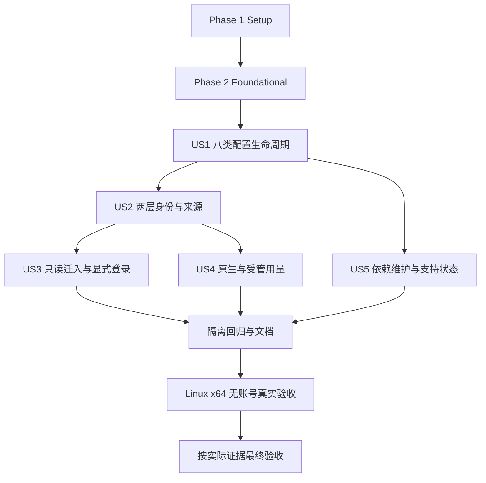

# Tasks: OMP 配置统一纳管与原生 Profile 兼容

**Input**: `specs/002-manage-omp-config/` 的 [spec.md](spec.md)、[plan.md](plan.md)、[research.md](research.md)、[data-model.md](data-model.md)、[contracts/CLI](contracts/cli-and-configuration.md)、[原生能力](contracts/native-capabilities.md)、[运行依赖](contracts/runtime-and-dependencies.md)、[quickstart.md](quickstart.md)、[验证矩阵](validation-matrix.md)。

**Prerequisites**: 规格澄清、计划及[验收范围修订](scope-change-20260924.md)已完成；实际分支 main。实施状态以复选框及 [implementation-progress.md](implementation-progress.md) 的实际证据为准。

**Tests**: FR-028 明确要求隔离测试，故本清单包含有行为断言的测试任务；先写故事测试并观察目标行为缺失导致失败，再实现和验证。仅导入错误/空收集不能作为充分的失败或通过证据。默认测试使用仓库 `.venv/bin/python`，不走 uv run，不启动第三方宿主；当前真实验证仅为 Linux x64 无账号 smoke；其他平台与账号验证已转独立遗留。

**Organization**: Phase 1/2 是共享前置，Phase 3–7 按 US1–US5 及 P1/P2 排序，Phase 8 为共同收尾；不以MVP削减已承诺八类能力。

**当前范围**：62 项任务全部完成；T062–T065 与 T061 的 Linux arm64 部分已按用户决定转入[OMP-F01–F05](../../docs/follow-ups/omp-platform-and-live-validation.md)，不再作为本 spec 的未完成任务，未验证事实保留。

## Format 与执行约定

- 每项固定 `- [ ] T编号 [P可选] [USn故事阶段必需] 描述和精确文件路径`，路径相对仓库根；新增文件在对应任务中创建。
- `[P]` 仅表示该阶段指定批次内文件不重叠、无相互前置，可在共同前置完成后并行；不是可以跳过Phase 2或任意全局并行。最多两个子任务，同一文件单写入者。
- 同阶段按编号执行；连续[P]为一个并行批次，下一非[P]任务等待该批次完成。单独[P]可与文末列出的其他独立文件任务组合；其余不自行推断并行。
- 每个任务包带本文条目、相关contract与输入文件、可写文件、已决定不变量、验收命令和升级条件。主代理验收关键边界；实现交executor（gpt-5.6-sol/medium），只读证据交scout（gpt-5.6-luna/medium）。共享文件整合由单一执行者完成。
- 验收命令中的相对路径均从仓库根执行。代码任务先用所列故事测试验证，阶段验证任务集中记录结果；不必为纯文档修改新增测试。
- 新证据推翻原生兼容/锁/事务顺序时回主代理调整方案；不得自行删减类别、放宽秘密或来源边界。未授权真实执行先保留未完成，继续独立任务。

## Phase 1: Setup — 现有工程内准备

目标：准备最小模块、隔离夹具与证据记录；不重新初始化 Python 工程，不安装或运行第三方宿主。

- [X] T001 在 `src/agentcfg/omp.py`、`src/agentcfg/omp_dependencies.py` 建立遵循现有 Adapter/DependencyBackend 接口的模块骨架，并在 `specs/002-manage-omp-config/implementation-progress.md` 建立“已完成、进行中、失败待决策、环境不足未验证”四类记录；骨架不得宣称功能支持。
- [X] T002 [P] 在 `tests/omp_fixtures.py` 建立临时 HOME/XDG、假 OMP/下载器、虚构 provider/model、两受管配方及原生 default/两个命名 profile 哨兵，复用 `tests/conftest.py` 的断网/假进程边界，不弱化现有测试。
- [X] T003 [P] 在 `specs/002-manage-omp-config/evidence/README.md` 固定平台、提交、锁/包摘要、命令、退出码、断言与授权范围格式，区分隔离测试、宿主 smoke、登录、usage、模型调用；无记录一律未执行。

## Phase 2: Foundational — 所有故事的阻塞前置

目标：完成共享身份、保护边界、依赖与运行门控。以下阶段全部通过后才开始用户故事；US5 负责进一步维护场景与支持证据，不把 US1 必需的 lock/sync 留到 US5。先写隔离测试，确认因目标行为缺失而失败，再实现并运行。

- [X] T004 [P] 在 `tests/test_omp_foundation.py` 写严格 schema/引用/合并、原生身份算法、nonempty owner/链接冲突、OMP bare-env guard 被删除或伪造、旧 DSH/Pi `$VAR` 状态兼容的失败用例；覆盖 V01/V05/V08/V16/V21。
- [X] T005 [P] 在 `tests/test_omp_runtime_foundation.py` 写假运行包的 lock/sync/receipt、物理实例锁先于 state lock、默认来源拒绝、必要 secret 缺失3、无包5、pending/活动4与成功子进程退出码测试；在首次注册run前先写固定CLI grammar的token-aware argv门禁断言，覆盖`--profile`/`--alias`/`--config`/`--session-dir`/`--extension`及`-e`/`--hook`/`--plugin-dir`/cwd绕过、等号与重复形式、secret/broker和危险子命令，同时证明普通`--`后提示文本不被误判；不得启动真实 OMP。
- [X] T006 在 `schemas/omp-agent.schema.json`、`schemas/omp-native.schema.json`、`schemas/profile.schema.json`、`src/agentcfg/config.py` 定义 OmpProfile/Resource/McpBinding 与 agent/bindings/plugins/content 严格输入：“agent=omp；公共 ID 保持现有严格校验；未知字段失败；对象合并、数组替换、false/空数组不丢失”；resource 的 kind 仅 prompt/theme、scope 仅 global，“路径为仓库内普通文件；主题使用固定 schema”；MCP公共transport为stdio/streamable-http、原生为stdio/http，“args 字面传递；禁止隐式下载程序与执行式 secret”；PluginPackage严格校验id/source/entrypoints/tree_digest/license/compatibility与未知字段；原生schema按config/models/keybindings/mcp四类定义生成字段/codec/selector形状，仅验证管理器生成的意图，不据此拒绝或丢弃已有未受管原生字段；其余精确字段依CLI/能力契约，raw-native与身份覆盖均拒绝。
- [X] T007 在 `src/agentcfg/omp_identity.py` 实现 NativeIdentity 全字段与规范路径：“native_name=`rotom-`+完整哈希前24hex；完整 ID/hash 一起比较，碰撞失败；不允许用户覆盖 native_name”；输入哈希为 UTF-8 profile.id，HOME 固定 `<instance>/user-home`、agent_dir 固定 `.omp/profiles/<native_name>/agent`，按 agent/profile 分隔 state/cache，XDG 不创建可触发原生重定向的 profile 目录。
- [X] T008 在 `src/agentcfg/adapter.py`、`src/agentcfg/native_projection.py`、`src/agentcfg/deployment.py` 实现版本化 omp-env-name 与强制 adapter/path/selector 分类：“字段 selector 不重叠；秘密叶子必须有强制守卫”；只接受登记的 `AGENTCFG_OMP_*` 整值引用，覆盖当前、基线、backup、pending、rollback，秘密漂移不读取到可输出投影，保留旧 `$VAR` 兼容。
- [X] T009 在 `schemas/omp-lock.schema.json`、`src/agentcfg/omp_dependencies.py` 定义 OmpLock/RuntimeReceipt 严格结构：schema/adapter version、tag/commit、平台 asset URL/SHA256、上游锁/许可证摘要、资源/plugin 清单与执行位/树摘要、入口/解释器要求；receipt 包含实际平台、产物摘要、精确解释器身份、安装路径和 lock 摘要，“无 secret。包激活只在所有项验证通过后发生”。
- [X] T010 在 `src/agentcfg/omp_dependencies.py` 实现供后续CLI调用的lock resolver/backend（本任务用后端接口独立验收，不修改parser），固定 v18.3.0/62bc57be1b03ef0802a33cf7f5f530e534527531、不可变源码归档与官方二进制完整性、完整 bun.lock/许可证及本地包闭包；不得复用 tag 归档 SHA 充当 commit URL 的 SHA，不运行上游安装脚本或宿主。
- [X] T011 在 `src/agentcfg/omp_dependencies.py` 实现只消费锁的 sync、cache 暂存/正文与链接/入口验证、receipt 和原子激活；失败保留上一包与所有 HOME，已有有效缓存可离线使用；固定 glibc/macOS x64/arm64，musl/Windows 失败5，禁止全局 OMP 回退及系统 Bun/Node 隐式安装。
- [X] T012 在 `src/agentcfg/omp_discovery.py`、`agents/omp/discovery-manifest.json` 实现固定源码发现清单与默认 preflight：cwd/全部祖先、active/default profile、generic/direct helper、dotenv 与 broker/gateway；注入能力契约的18项 disabledProviders及关闭更新/项目发现设置，保留 native/builtin-defaults，拒绝与禁用项同名的自定义 provider；运行时未声明来源失败4。
- [X] T013 在 `src/agentcfg/omp_identity.py` 实现 InstanceOwnership 和 lifecycle_guard：“绑定物理实例和管理状态；第二 state_root 或配方不得接管同一目录”；owner 全字段含 machine/local/state/nonce，文件0600、目录0700，物理 lease→state lock 固定顺序，owner 初始化与 pending 可恢复，只首次 apply 创建新身份，非空异主/越界/布局改变失败4，不杀进程。
- [X] T014 在 `src/agentcfg/runtime.py`、`src/agentcfg/process.py`、`src/agentcfg/omp.py` 接入RuntimeBinding全字段并统一身份推导；这里“使用同一绑定”不等于预先存在部署：validate/render只构造校验candidate identity/intent，不要求owner/deployed binding/运行包；plan比较candidate与可为空的已有状态；首次apply持久化binding；doctor检查已有状态并可报告未部署，run/capture/rollback/managed usage消费已部署binding。新增受控operation上下文，并实现T005先行验证的共享token-aware argv parser：任何受管spawn均先分类操作，拒绝覆盖身份/来源/cwd的参数、secret/broker控制、危险子命令及等号/重复/别名绕过，只允许已声明精确模型且不误判`--`后的普通提示文本。普通run的必要SecretBinding“仅存引用；env名使用完整ID哈希的前24hex并检测碰撞；值只在实际需要的启动操作解析”；拒绝身份env覆盖，检查owner/pending/projection/receipt/source，spawn前复查并持锁至退出，login/usage不解析无关secret。
- [X] T015 在 `src/agentcfg/workspace.py`、`src/agentcfg/cli.py`、`src/agentcfg/commands.py` 注册OMP adapter/backend、CLI的 `lock --agent omp` parser/commands分发与run的omp选择，同时建立 `agents/omp/agent.toml`、`agents/omp/bindings.toml`、`agents/omp/plugins.toml`、`agents/omp/content.toml` 与 `profiles/omp-default.toml` 的最小空集合bootstrap声明和受保护设置渲染，使现有workspace能装载全部adapter而不依赖US1后续资源；保留全局参数前置与管理器0/2/3/4/5/6语义；公共配置操作离线，native child 流和退出码不改写；配置 pending 只沿现有 deployment.recover 在显式 apply/rollback 中恢复，不扩展 `recover pi`。
- [X] T016 运行 `tests/test_omp_foundation.py`、`tests/test_omp_runtime_foundation.py` 及受影响的 `tests/test_adapter.py`、`tests/test_deployment.py`、`tests/test_config_schema.py`，修复本阶段失败并将命令/断言写入 `specs/002-manage-omp-config/evidence/foundation.md`；测试必须有实际收集，不能以骨架或假进程退出0代替行为断言。

## Phase 3: User Story 1 — 用统一入口管理 OMP 配置 (P1)

**Goal**：八类九行配置与完整生命周期可用。

**Independent Test**：一个虚构验收 profile 覆盖九行，离线完成 validate/render/plan/sync替身/apply/重复apply/doctor/run替身/capture/rollback，正负向均断言；原生生效另由最终授权任务验证。

- [X] T017 [P] [US1] 在 `tests/test_omp_adapter.py` 为九行映射写正向与未知字段/不支持协议/角色/未选引用/资源越界/secret负向测试，验证agent/bindings/plugins/content及PluginPackage闭合schema、四类生成原生文档的codec/selector/字段形状、确定性字节、主题完整性、空快捷键数组和配置阶段脚本/扩展执行次数为0；已有未受管字段保留。
- [X] T018 [P] [US1] 在 `tests/test_omp_pipeline.py` 写写前预览、三方比较、未受管字段保留、重复apply零写入/零备份轮换、双方冲突、owner初始化中断、apply与rollback两条pending恢复、rollback消费备份的隔离契约测试；同时先写普通run加--no-title、help/version中性cwd且无会话参数、默认doctor不spawn/不读auth/不联网、doctor --live不登录/生成/安装的断言；首次validate/render/plan不要求已部署binding或运行包。
- [X] T019 [P] [US1] 在 `tests/test_omp_capture.py` 写 theme.dark/light、已声明 action、唯一反查 modelRoles 的提案测试，未声明/歧义模型与auth/trust/session/log/cache不得捕获，所有输出/backup/pending均扫描秘密哨兵。
- [X] T020 [US1] 在 `src/agentcfg/omp.py`、`agents/omp/bindings.toml` 实现 provider/model/roles 叶子映射：“不添加任意 native 设置；禁止 URL 中的凭据”；自定义模型严格要求context_window/max_output_tokens且不伪造cost，main→default与smol/slow/vision/plan/advisor使用精确provider/remote-id，vision需图像能力，重复原生provider/模糊ID失败，codex OAuth映射openai-codex并保留无静态模型bootstrap。
- [X] T021 [US1] 在 `src/agentcfg/omp.py`、`agents/omp/content.toml` 实现两份公共规则生成RULES.md与完整技能逐文件部署；保留SKILL.md/相对资源/执行位，复用显式模板许可，拒绝断链/链接越界/同名冲突，不执行脚本；将隔离完整包样例放入 `tests/fixtures/omp/skills/full-package/SKILL.md` 及关联资源。
- [X] T022 [P] [US1] 在 `agents/omp/resources/prompts/rotom-review.md`、`agents/omp/resources/themes/rotom-dark.json`、`schemas/omp-theme.schema.json` 准备固定版本合法提示词与完整主题样例/schema，验证可供 `/rotom-review` 与dark/light主题选择使用，记录来源及许可。
- [X] T023 [P] [US1] 在 `agents/omp/packages/rotom-health/index.ts`、`agents/omp/packages/rotom-health/package.json` 实现无外部依赖的原生OMP扩展样例，`/rotom-health`返回固定非秘密标记；遵守“入口位于锁定包内，不在 render 时导入”，逐项核实API而非复用Pi兼容结论。
- [X] T024 [P] [US1] 在 `agents/omp/packages/echo-mcp/server.py` 准备无外部依赖的本地stdio MCP fixture，支持初始化、tools/list和一次echo调用；不接真实服务/账号，解释器精确身份纳入receipt，不通过npx/uvx下载。
- [X] T025 [US1] 在 `src/agentcfg/omp.py` 实现prompt/theme文件、theme.dark/light、action→string|string[]快捷键、锁定扩展绝对入口列表及MCP字段意图；MCP env/header仅生成变量引用，HTTP credential_ref表示完整Authorization header，拒绝SSE/OAuth/!command/任意header与未锁command，缺必要secret由管理器spawn前报3。
- [X] T026 [US1] 在 `agents/omp/agent.toml`、`agents/omp/plugins.toml`、`profiles/omp-default.toml`、`examples/omp-validation.local.toml` 配置无九行声明的bootstrap默认；另在 `tests/fixtures/omp/registry.toml`、`tests/fixtures/omp/profiles/omp-validation.toml` 声明已登记的九行完整虚构验收配方，local仅覆盖既有ID。smoke模型输入固定为已支持的openai-compatible/api-key，`base_url="https://omp-validation.invalid/v1"`、`credential_ref="secret:omp_smoke_placeholder"`，临时0600 local只写公开假值`omp_smoke_placeholder="rotom-smoke-not-a-secret"`；它不是凭据，只验证模型列表/角色且严禁发请求，本地stdio无需认证。定义后续真实smoke的临时验收仓库投影：从当前工作树复制所需`agentcfg`、`src/`、`shared/`、`agents/`、`schemas/`、`locks/`等受审源，不以链接回原工作树替代复制；临时`.venv`仅符号链接复用当前已准备环境且禁止安装/下载Python依赖；将fixture registry装入临时`shared/omp-validation.toml`、profile装入临时`profiles/omp-validation.toml`，并把完整技能包复制到该临时配方声明的仓库内路径；不得改写正式bootstrap或让local偷建profile。通过已实现lock后端生成并审阅首轮完整正式锁组`locks/omp/manifest.json`、`locks/omp/upstream/bun.lock`、`locks/omp/upstream/provenance.json`、`locks/omp/upstream/NOTICE.md`，覆盖新增资源/扩展/MCP闭包，并对正式锁做来源、结构和引用的静态校验；同步契约只使用隔离临时测试仓库中的独立synthetic完整锁及摘要匹配的假包验证，不让假字节匹配正式SHA或让假验证器绕过完整性。synthetic包/锁禁止写入生产锁或充当真实smoke证据，真实smoke只消费正式锁和真实字节。
- [X] T027 [US1] 在 `src/agentcfg/omp.py`、`src/agentcfg/commands.py` 接通八类ManagedIntent与公共validate/render/plan/apply/rollback，文件/JSON Pointer叶子所有权不重叠，auth运行文件不纳管，源渲染不读取当前原生文件，pending按公共事务恢复，配置rollback不降级软件。
- [X] T028 [US1] 在 `src/agentcfg/omp.py` 接入现有capture allowlist并生成校验后的私人非秘密覆盖提案，theme/keybindings/modelRoles外拒绝反向导入；原生角色漂移不自动注册公共模型，guard失效只报告敏感漂移，不输出值。
- [X] T029 [US1] 在 `src/agentcfg/omp.py`、`src/agentcfg/commands.py` 完成run会话/信息操作与默认doctor：普通会话增加--no-title，help/version使用中性cwd且不加会话参数；静态doctor不运行宿主或打开auth DB，可报告待登录；doctor --live仅沿既有服务探测，禁止登录/模型生成/隐式安装。
- [X] T030 [US1] 执行 `tests/test_omp_adapter.py`、`tests/test_omp_pipeline.py`、`tests/test_omp_capture.py` 并将九行成功/失败断言及未执行原生项写入 `specs/002-manage-omp-config/evidence/us1.md`；必须含main+smol、两规则、完整技能、提示词、完整主题、Ctrl+P与[]、扩展入口和stdio/HTTP映射。

## Phase 4: User Story 2 — 明确选择与隔离两层 Profile (P1)

**Goal**：向用户提供完整身份、继承与项目来源行为，验证共享基础边界。

**Independent Test**：复用US1已可部署样例，两个受管配方加原生default/两个命名profile，覆盖环境/参数/布局/碰撞/来源与跨工具哨兵；不依赖真实账号。

- [X] T031 [P] [US2] 在 `tests/test_omp_profiles.py` 写空白/保留default/穿越/重复选择、完整hash碰撞、改名、不同state_root、OMP_PROFILE/PI_PROFILE/目录覆盖、XDG profile目录出现的拒绝测试，断言受管与default/已有命名profile及DSH/Pi所有哨兵零意外变化。
- [X] T032 [P] [US2] 在 `tests/test_omp_discovery.py` 写cwd/祖先、generic/direct、dotenv、default快捷键继承和project opt-in的正负向测试；模拟检查后普通漂移验证spawn前复查，断言broker禁用、18项disabled清单及provider同名冲突。
- [X] T033 [US2] 在 `src/agentcfg/omp_discovery.py` 实现SourcePolicy opt-in：“启用时根必须显式列出且与 cwd/祖先发现路径匹配；默认空列表。记录路径及摘要，不存 .env/auth 内容。每次进程创建前复核实际来源，不能凭上次检查跳过”；仅允许声明根的只读非秘密skills/MCP，其他project rules/prompts/extensions/settings仍拒绝，根/policy变更需重新apply。
- [X] T034 [US2] 在 `tests/test_omp_profiles.py` 补两受管profile/default/已有命名profile下的共享token-aware argv parser专项回归，并在确有必要时仅于`src/agentcfg/omp.py`接入T014现有parser；证明相同禁止参数、等号/重复/别名绕过和`--`后提示文本在不同身份中判定一致，不在本任务首次实现parser。模型只允许已声明精确ID，用户身份env覆盖失败2，已部署保护边界漂移失败4。
- [X] T035 [US2] 在 `src/agentcfg/omp_identity.py`、`src/agentcfg/omp.py` 完成plan/doctor有效来源报告：配方/native name/HOME/XDG/实际agent目录/默认快捷键继承路径与摘要/账号会话作用域/项目来源；改名明确新身份及迁移提示，保留旧数据，不读取账号明细或修改default文件。
- [X] T036 [P] [US2] 在 `docs/omp-profiles.md` 说明两层profile算法、原生优先级、XDG存在性切换、隔离HOME必要性、支持的project opt-in和不属于OS沙箱的边界，提供两配方虚构选择/冲突例子。
- [X] T037 [US2] 执行 `tests/test_omp_profiles.py`、`tests/test_omp_discovery.py`，与US1夹具组合验证生命周期身份一致、活动lease互斥、不同machine/local/state无法争用同一实例，将V04/V05/V06/V09/V16/V21实际结果写入 `specs/002-manage-omp-config/evidence/us2.md`。

## Phase 5: User Story 3 — 安全迁入已有 OMP 配置与资源 (P1)

**Goal**：只读盘点非秘密配置，审阅后导入新环境并提供显式重新登录入口。

**Independent Test**：合成旧来源含完整资源与secret/auth/session哨兵，inventory生成三类私人产物；测试夹具代替用户审阅合并获准项后部署新身份，旧来源字节/权限/链接不变；登录仅用假进程。

- [X] T038 [P] [US3] 在 `tests/test_omp_inventory.py`、`tests/test_omp_migration_flow.py` 写审阅后新环境部署/非空冲突/pending恢复及每项四类处置/理由、review-required、路径/敏感字段/已知秘密扫描、三类cache产物、无整HOME归档、秘密及运行文件排除、技能完整关系和新目标独占写入测试。
- [X] T039 [P] [US3] 在 `tests/test_omp_login.py` 写显式 `run omp -- login openai-codex` 的argv/neutral cwd/锁/env测试，bootstrap无模型可登录、不解析无关MCP/API key、不加--no-title、拒绝未适配provider、不借用旧auth/session。
- [X] T040 [US3] 在 `src/agentcfg/omp_inventory.py` 实现InventoryProposal全字段：“disposition 取纳入/原生保留/替代/排除，另有 review_required 状态。来源只读；私人 cache 权限 0700、文件0600；不自动合并仓库，不复制运行数据”；只能读取允许字段和选定资源，无法证明可复制内容标记审阅，不执行资源代码。
- [X] T041 [US3] 在 `src/agentcfg/cli.py`、`src/agentcfg/commands.py` 接入 `inventory omp --source ABS_PATH`，只写私人cache的disposition.json/local-overrides.toml/resources，source auth键仅报告未导入，不写仓库/来源/目标；提案需通过严格schema，不添加import或强制接管入口。
- [X] T042 [US3] 在 `src/agentcfg/omp.py` 完成login操作分类/允许provider映射和中性cwd，复用同一已部署二进制/owner/runtime gate，原生认证只在新HOME建立；仅显式调用允许登录，配置生命周期不触发登录。
- [X] T043 [P] [US3] 在 `docs/omp-migration.md` 记录手工审阅TOML/候选包→声明→validate/render/plan/apply、资源变更后的显式lock/sync、新旧目标独占与故障恢复、退出新环境继续使用旧环境及受管login路径；完整技能保留，Pi扩展必须独立核实，无账号/会话迁移。
- [X] T044 [US3] 执行 `tests/test_omp_inventory.py`、`tests/test_omp_login.py`、`tests/test_omp_migration_flow.py`，验证合成来源到新环境的审阅后部署/非空冲突/pending恢复端到端场景，将处置率100%、旧环境零变化、secret零泄漏和真实登录未执行写入 `specs/002-manage-omp-config/evidence/us3.md`。

## Phase 6: User Story 4 — 在统一入口查看 OMP 订阅用量 (P2)

**Goal**：实现AGENTCFG-F01的原生/受管usage薄封装。

**Independent Test**：假OMP逐字节对比argv/stdout/stderr及退出码，覆盖无配置原生模式和已部署受管模式、缺程序/未登录/不支持/部分失败/身份冲突，不调用真实订阅接口。

- [X] T045 [P] [US4] 在 `tests/test_omp_usage_native.py` 写无workspace/local/secrets的PATH模式测试，保留完整cwd/env/argv与二进制流/任意原生退出码，剥离一个可选前导--，缺程序5、--local/--machine无显式profile为2，并断言不读取rotom配置且管理状态/受管目录零变化。
- [X] T046 [P] [US4] 在 `tests/test_omp_usage_managed.py` 写显式profile模式测试，底层 `omp --profile NAME usage tail`、neutral cwd、同一runtime gate/lease、无关secret缺失不阻塞、身份覆盖2、活动/pending4/缺包5、不额外聚合profile；包括usage与run互斥。
- [X] T047 [P] [US4] 在 `tests/fixtures/omp/usage-cases.json`、`tests/test_omp_usage_results.py` 补无账号/不支持/部分失败/缓存与窗口/四类provider的原生输出替身，对照断言机器stdout无说明、缺失不造零、无自创provider重命名、无账号导出与额外网络。
- [X] T048 [P] [US4] 实施前重新核实固定版usage入口和国内智谱官方用量支持，更新 `docs/omp-usage.md` 的来源/日期/限制；区分zhipu-coding-plan、zai、kimi-code、openai-codex，不因网页失败推断不存在接口，不抓Cookie、不新增采集器，不把上游不可验证当完成证据。
- [X] T049 [US4] 在 `src/agentcfg/usage.py`、`src/agentcfg/cli.py`、`src/agentcfg/commands.py` 实现显式选择检测与workspace加载前分发的native usage；管理器全局参数仅在命令前解析，原生tail原样传递，PATH/cwd/env和流直接继承，成功spawn后保留退出码及既有128+signal约定。
- [X] T050 [US4] 在 `src/agentcfg/usage.py` 接通managed usage，显式非OMP profile失败2，禁止身份/来源tail覆盖，复用deployed identity/receipt/来源检查与操作环境，不读无关SecretRef、不跨profile，不自动sync/apply/login或生成模型；只显式usage允许原生缓存/认证刷新。
- [X] T051 [US4] 执行 `tests/test_omp_usage_native.py`、`tests/test_omp_usage_managed.py`、`tests/test_omp_usage_results.py` 并按V12–V14/V20记录逐字节透传及隔离断言到 `specs/002-manage-omp-config/evidence/us4.md`；`docs/omp-usage.md` 给出两模式、副作用和可操作错误示例，真实usage保留未执行。

## Phase 7: User Story 5 — 可复现准备依赖并核实支持状态 (P2)

**Goal**：在共享lock/sync基础上验证维护/修复/升级失败和多平台支持，形成可追溯交付。

**Independent Test**：完整虚构包闭包和平台替身覆盖锁损坏、正文篡改、暂存失败、原子切换、旧包保留、依赖变更与已部署binding不匹配；真实平台支持按独立证据登记。

- [X] T052 [P] [US5] 在 `tests/test_omp_dependencies.py` 写完整锁缺项/版本与commit不符/SHA/资源执行位/解释器身份不符、链接越界/入口缺失/同size篡改、sync失败保留上一包、离线cache复用和run不隐式修复的故障注入测试。
- [X] T053 [P] [US5] 在 `tests/test_omp_platforms.py` 写glibc/macOS x64/arm64资产选择、musl/Windows拒绝、不得退回全局OMP，以及宿主/marketplace/autolearn关闭和禁用未锁按需依赖的静态/假进程用例。
- [X] T054 [US5] 使用已实现resolver对T026首轮完整锁组 `locks/omp/manifest.json`、`locks/omp/upstream/bun.lock`、`locks/omp/upstream/provenance.json`、`locks/omp/upstream/NOTICE.md` 做最终重新解析、生成与审阅，核对全部选定资源/扩展/MCP及各平台来源与SHA；网络不可用保留真实未完成状态，禁止提交占位摘要、遗漏首轮文件或把源码检查当二进制验证。
- [X] T055 [US5] 在 `src/agentcfg/omp_dependencies.py` 完成维护/修复路径的精确正文与目录验证、旧运行包引用保护、失败暂存清理与诊断；sync不改HOME/锁，激活更新后旧deployment不得自动跟随，配置rollback不降级软件，旧包不可用时后续run失败5。
- [X] T056 [P] [US5] 在 `docs/omp-dependencies.md`、`docs/omp-support.md` 记录固定发布/完整锁/解释器/本地包身份、四个平台、更新步骤和证据状态；源码事实、隔离通过、宿主通过、账号通过分别列示，musl/Windows排除、macOS未验证不冒充通过。
- [X] T057 [US5] 执行 `tests/test_omp_dependencies.py`、`tests/test_omp_platforms.py` 及基础运行包测试，将V10/V11/V24实际结果、无隐式宿主执行/安装及旧包HOME哨兵写入 `specs/002-manage-omp-config/evidence/us5.md`。

## Phase 8: Polish & Cross-Cutting — 回归与分层验收

目标：完善用户说明、执行隔离回归与本机 Linux x64 无账号真实验收。按用户范围修订，其他平台与真实账号验收转独立遗留，保持未验证，不阻塞本 spec 完成。

- [X] T058 更新 `README.md`、`docs/adapters.md`、`docs/omp.md` 与 `specs/002-manage-omp-config/quickstart.md`，核对真实CLI、九行样例、配置副作用、退出码、profile/迁入/usage/依赖说明互链，明确日常bootstrap `omp-default` 与真实smoke专用临时仓库已登记 `omp-validation` 的区别，写出T026临时投影、只复用现有`.venv`、完整正式锁与必要时显式lock再sync的顺序；不修改无关DSH/secrets缺陷。
- [X] T059 运行 `.venv/bin/python -m pytest -q`，在 `specs/002-manage-omp-config/evidence/regression.md` 记录OMP及现有DSH/Pi实际收集/结果，核对跨工具目录/账号/状态哨兵和0/2/3/4/5/6退出码；失败只修本轮受影响路径后重跑必要范围，环境不足不得记通过。
- [X] T060 在 `tests/test_omp_secret_boundaries.py` 汇总扫描正常/冲突/异常/capture/inventory/backup/pending/rollback中的秘密哨兵，模拟删除guard和原生字面secret；实际执行并将零泄漏与所有权断言写入 `specs/002-manage-omp-config/evidence/security.md`，不读取真实凭据。
- [X] T061 在明确授权且本机 Linux glibc x64 环境可用后，按T026/T058与 `specs/002-manage-omp-config/quickstart.md` 创建新临时验收仓库和HOME，复制fixture registry、已登记`omp-validation` profile、完整技能包及当前受审源（除`.venv`外不链接原工作树），仅以符号链接复用现有`.venv`且不拉Python依赖；在临时0600 local写T026公开假值，使用既有正式locks完整闭包，若fixture选中资源尚未入锁则先显式lock再sync。必须执行固定真实二进制并核对实际SHA/零自动安装和九行原生生效，包含模型列表/角色但不发请求、/rotom-review、主题和快捷键、/rotom-health、无认证stdio tools/list与受控调用；严禁假二进制/假receipt，不登录/查真实usage/调用模型，结果写入 `specs/002-manage-omp-config/evidence/linux-smoke.md`；Linux arm64 实机验证已转 OMP-F01，不属于本任务当前范围。
- [X] T066 按实际证据更新 `specs/002-manage-omp-config/validation-matrix.md`、`specs/002-manage-omp-config/implementation-progress.md`、`docs/follow-ups/agentcfg-usage-command.md`、`docs/follow-ups/README.md` 和 `docs/omp-support.md`，完成FR/SC双向追踪与文档链接检查；仅满足范围的AGENTCFG-F01可关闭，八类原生证据不齐不能宣称SC-001完成，无关缺陷保持原状态。

## 已转出的原任务（不计当前待办）

| 原编号 | 后续编号 | 当前归属 |
|---|---|---|
| T061 的 Linux arm64 部分 | OMP-F01 | 独立平台遗留 |
| T062 | OMP-F02 | macOS 实机遗留 |
| T063 | OMP-F03 | 真实登录遗留 |
| T064 | OMP-F04 | 真实 usage 遗留 |
| T065 | OMP-F05 | 指定模型调用遗留 |

原描述见[范围修订](scope-change-20260924.md)，执行前提、通过条件与恢复入口见[独立遗留清单](../../docs/follow-ups/omp-platform-and-live-validation.md)。

## Dependencies & Execution Order

- T001 后，T002、T003 可并行；Phase 2 在Setup全部完成后开始。
- Phase 2 的测试批次 T004、T005 可并行；T006、T007、T008、T009、T010、T011、T012、T013、T014、T015 依序完成并以 T016 为硬门禁；T005先固定argv门禁断言，T014完成共享parser，T015才注册run，身份/安全/安装不能延后到US2/US5。
- US1 从 T017 开始，以 T030 完成隔离闭环；T026 必须等待prompt/theme、extension、MCP包全部完成，生成manifest及三个upstream文件的首轮完整正式锁组并验证临时synthetic锁不污染它；T054是最终重新解析/审阅，不是US1首次获得可用锁。
- US2 依赖US1可部署样例。US3、US4依赖US1+US2的受管身份；US4原生分支测试 T045 本身不依赖已部署配置，可在基础完成后提前独立验证，但故事完成须通过managed分支。
- US5依赖基础后端和US1包样例；其测试/文档可与US2/US3/US4无文件冲突部分并行。`src/agentcfg/omp.py`、cli.py、commands.py、omp_dependencies.py、locks/omp/manifest.json为单写入者文件，涉及它们的任务不得交叉同时写入。
- 收尾 T058、T059、T060 在故事隔离验收之后；T061 仅本机 Linux x64，使用临时验收仓库的已登记 `omp-validation`、正式锁与真实二进制。其他平台和账号验证的前置关系已转独立遗留，不参与当前任务依赖。
- T066 按真实结果执行证据审阅；当前范围内验证必须完成；已转出的真实验证保留未验证状态，不计入当前完成门禁。配置pending恢复沿apply/rollback，不增加Pi租约恢复依赖。

## Parallel Examples — 每个故事

| 故事 | 共同前置 | 可并行任务（最多两个同时执行） | 合流/单写入者约束 |
|---|---|---|---|
| US1 | Phase 2完成 | T017、T018；随后capture测试；资源批次 T022、T023、T024 分两槽 | 所有资源齐备后才做 T025、T026；omp.py串行 |
| US2 | US1隔离验收通过 | T031、T032；T036 可与不写该文档的实现并行 | opt-in/参数/报告合流后 T037 |
| US3 | US2隔离验收通过 | T038、T039；T043 可与login实现并行 | inventory CLI与其他cli.py写入串行，最后迁入闭环 |
| US4 | US2隔离验收通过 | T045、T046；T048 可占独立只读证据槽 | usage.py两分支顺序整合；最终文档写入等待研究完成 |
| US5 | US1隔离验收通过 | T052、T053；T056 可与依赖维护实现并行 | 锁和backend单写入者，收集包齐全后更新锁 |

## 需求与验收追踪

任务验收以 [validation-matrix.md](validation-matrix.md) 的详细断言为准；下表给出执行入口，不把计划/任务存在视为证据。

| 需求 | 实现/验证任务 | 场景 |
|---|---|---|
| FR-001、FR-002 | T020、T021、T022、T023、T024、T025、T026、T027、T028、T029、T030、T061 | V02/V03/V11/V15/V22，本机 Linux x64 八类九行成功 |
| FR-003 | T006、T017、T020、T025 | V01/V03 |
| FR-004 | T013、T018、T027、T030 | V03/V15/V16 |
| FR-005、FR-006、FR-007、FR-008、FR-009、FR-010 | T005、T007、T012、T013、T014、T031、T032、T033、T034、T035、T037、T050 | V04/V05/V06/V13/V15/V17/V18/V21/V23 |
| FR-011、FR-012、FR-013 | T028、T038、T040、T041、T042、T043、T044 | V07/V08/V16/V17 |
| FR-014、FR-015 | T008、T014、T021、T023、T025、T019、T060 | V01/V08/V09/V16 |
| FR-016、FR-017 | T009、T010、T011、T012、T014、T029、T026、T052、T053、T054、T055、T057 | V10/V11/V24 |
| FR-018、FR-019、FR-020、FR-021、FR-022、FR-023、FR-024 | T045、T046、T048、T049、T050、T047、T051 | V12/V13/V14/V19/V20 |
| FR-025 | T005、T014、T015、T034、T030、T051、T057、T059 | V05/V10/V12/V16/V20 |
| FR-026 | T016、T037、T059 | V18，DSH/Pi回归 |
| FR-027、FR-028 | T003、T036、T043、T048、T056、T058、T059、T060、T061、T066 | V01–V24，分层记录未验证 |

| 成功标准 | 任务入口与量化门禁 |
|---|---|
| SC-001 | T030、T061：八类100%、主题快捷键分别成功，实际平台证据逐项记录；未做原生生效则不宣称达成 |
| SC-002 | T037、T044、T051、T059：跨工具/profile哨兵意外变化0 |
| SC-003 | T018、T030、T057：无变化写入/备份轮换0，冲突/中断均可恢复 |
| SC-004 | T044、T060：处置率100%、秘密泄漏0、旧环境变更0、复制auth/session 0 |
| SC-005 | T051：两模式对照匹配，缺程序/无账号/不支持/部分失败/身份冲突均可重复 |
| SC-006 | T048、T056、T066：AGENTCFG-F01范围全映射，未验证计为通过0 |
| SC-007 | T035、T036、T037：每配方唯一报告身份/来源/账号作用域/切换保留数据 |

## Implementation Strategy

**建议MVP**：Phase 1+2+US1先形成可隔离演示的完整八类生命周期，再完成US2对多profile/继承与来源的专项验收。MVP是实施里程碑，不是删掉US3–US5的首版交付许可；US1真实生效仍需授权宿主证据。

**增量交付**：基础 → US1 → US2 → US3/US4与US5独立测试文档 → 共同回归 → 本机 Linux x64 无账号真实验收 → 当前 spec 完成；其他平台/账号项按独立遗留安排。每一故事均可用合成数据单独重跑自身测试，依赖的是已完成基础与指定前序故事，不依赖后序账号或模型服务。

**执行验收**：故事测试命令为 `.venv/bin/python -m pytest -q <该故事任务列出的tests文件>`；最终执行 `.venv/bin/python -m pytest -q`。完成一次相称验证后不因无新证据反复全量审查。真实步骤采用quickstart的实际命令并记录相应授权；不为了勾选任务自动索取账号或启动宿主。

**任务计数**：原计划 66 个编号；当前范围 62 项，已完成 62/62（T001–T061、T066）。T062–T065 共 4 项完整任务及 T061 的 Linux arm64 部分已转 OMP-F01–F05，保留原编号追踪，均未验证且不计当前待办。
